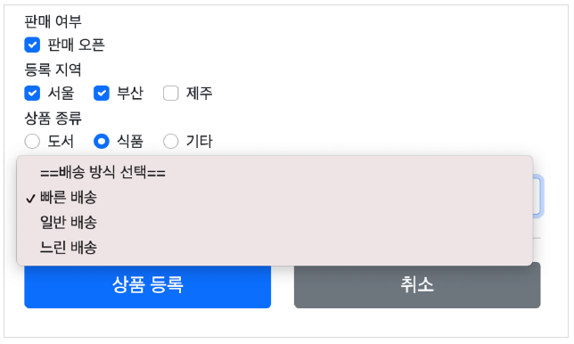

# 타임리프 스프링 통합 

타임리프 템플릿 엔진을 스프링 빈에 등록하고, 타임리프용 뷰 리졸버를 스프링 빈으로 등록하는 방법

+ https://www.thymeleaf.org/doc/tutorials/3.0/thymeleafspring.html#the-springstandarddialect
+ https://www.thymeleaf.org/doc/tutorials/3.0/thymeleafspring.html#views-and-viewresolvers

스프링 부트는 모두 자동화 해주기 때문에 `build.gradle`에 implementation을 추가하면 자등오러 설정 해준다.

`implementation 'org.springframework.boot:spring-boot-starter-thymeleaf'`


---

## 입력 폼 처리

기존 프로젝트의 폼 코드를 타임리프가 지원하는 기능을 사용해서 개선한다.

---

`th:object`: 커맨드 객체를 지정한다.

`*{...}`: `th:object`에서 선택한 객체에 접근한다.

`th:field`: HTML 태그의 id,name,value 속성을 자동으로 처리해준다.


**렌더링 전** 

`<input type="text" th:field="*{itemName}" />`

**렌더링 후**

`<input type="text" id="itemName" name="itemName" th:value="*{itemName}" />`

### 등록 폼

`th:object`를 적용하려면 오브젝트 정보를 넘겨주어야 한다. 등록 폼이기 때문에 빈 객체를 만들어서 뷰에 전달한다.

```java
    @GetMapping("/add")
    public String addForm(Model model) {
        model.addAttribute("item",new Item("itemB",100000,10));
        return "form/addForm";
    }
```

form/addForm.html

```html
<form action="item.html" th:action th:object="${item}" method="post">
        <div>
            <label for="itemName">상품명</label>
            <input type="text" id="itemName" th:field="*{itemName}" class="form-control" placeholder="이름을 입력하세요">
        </div>
        <div>
            <label for="price">가격</label>
            <input type="text" id="price" th:field="*{price}" class="form-control" placeholder="가격을 입력하세요">
        </div>
        <div>
            <label for="quantity">수량</label>
            <input type="text" id="quantity" th:field="*{quantity}" class="form-control" placeholder="수량을 입력하세요">
        </div>
```

`<form action="item.html" th:action th:object="${item}" method="post">`

`th:object="${item}`: <form>에서 사용할 객체를 지정한다. 

`th:field`는 `id`,`value`,`name` 속성을 `th:field`에서 지정한 변수 이름과 같이 만들어주기 때문에 다 지우고 `th:field="*{xxx}` 하나로 대체 할 수 있다.


### 수정 폼

```html
<form action="item.html" th:action th:object="${item}" method="post">
        <div>
            <label for="id">상품 ID</label>
            <input type="text" id="id" class="form-control" th:field="*{id}" readonly>
        </div>
        <div>
            <label for="itemName">상품명</label>
            <input type="text" id="itemName"  class="form-control" th:field="*{itemName}">
        </div>
        <div>
            <label for="price">가격</label>
            <input type="text" id="price"  class="form-control" th:field="*{price}">
        </div>
        <div>
            <label for="quantity">수량</label>
            <input type="text" id="quantity" class="form-control" th:field="*{quantity}">
        </div>
```

수정 폼도 `th:object`와 `th:field`로 수정해서 편리하게 사용한다.

`th:field`를 사용하지 않으면 변수명을 잘못 입력 했을경우 제대로 값을 받지 못하지만 `th:field`를 사용하면 오류페이지가 떠서 더 좋다.

이후 검증(Validation) 부분에서 폼 처리와 관련된 부분에서 큰 편리함을 얻을 수 있다.


---

##  요구사항 추가

+ 판매 여부
  + 판매 오픈 여부
  + 체크박스로 선택할 수 있다.
+ 등록 지역
  + 서울, 부산, 제주
  + 체크 박스로 다중 선택할 수 있다.
+ 상품 종류
  + 도서, 식품, 기타
  + 라디오 버튼으로 하나만 선택할 수 있다.
+ 배송 방식
  + 빠른 배송
  + 일반 배송
  + 느린 배송
  + 셀렉트 박스로 하나만 선택할 수 있다.




상품 종류 `ENUM` 클래스

```java
public enum ItemType {

    BOOK("도서"), FOOD("음식"), ETC("기타");

    private final String description;

    ItemType(String description) {
        this.description = description;
    }
}
```

배송 방식

```java
/**
 * FAST: 빠른 배송
 * NORMAL: 일반 배송
 * SLOW: 느린 배송
 */
@Data
@AllArgsConstructor
public class DeliveryCode {

    private String code;
    private String displayName;

}
```

`code`는 시스템에서 전달하는 값이고 `displayName`은 `빠른 배송` 같은 고객에게 보여주는 값이다.

Item

```java
@Data
public class Item {

    private Long id;
    private String itemName;
    private Integer price;
    private Integer quantity;

    private Boolean open; //판매 여부
    private List<String> regions; //등록 지역
    private ItemType itemType; //상품 종류
    private String deliveryCode; //배송 방식

    
    public Item() {
    }

    public Item(String itemName, Integer price, Integer quantity) {
        this.itemName = itemName;
        this.price = price;
        this.quantity = quantity;
    }
}
```

---

## 체크 박스 - 단일1


form/addForm.html 

```html
  <hr class="my-4">
        <!-- single checkbox -->
        <div>판매 여부</div>
        <div>
            <div class="form-check">
                <input type="checkbox" id="open" name="open" class="form-check-input">
                <label for="open" class="form-check-label">판매 오픈</label>
            </div>
        </div>
```

단일 체크박스를 추가한다. 

체크박스를 추가했을 경우 넘어오는 로그를 보면

체크박스 선택: `item.open=true` 
체크박스 선택X: `item.open=null`

HTML은 체크박스를 선택하면 `open=on`으로 값을 넘겨주지만 선택하지 않으면 `open` 필드 자체가 넘어오지 않기 때문에 `null`이 나오게 된다.

이러한 경우 서버에선 값이 오지 않은 경우로 판단해서 값을 변경하지 않을수도 있다.

스프링 MVC는 필드 이름 앞에 `_`를 붙여서 히든 필드를 하나 더 만들어서 이 값으로 체크 유무를 알아낼 수 있다.

```html
 <hr class="my-4">
<!-- single checkbox -->
<div>판매 여부</div>
<div>
  <div class="form-check">
    <input type="checkbox" id="open" name="open" class="form-check-input">
    <input type="hidden" name="_open" value="on"/> <!-- 히든 필드 추가 -->
    <label for="open" class="form-check-label">판매 오픈</label>
  </div>
</div>
```

**체크 박스 체크**

`open=on&_open=on`

체크 박스를 체크하면 스프링 MVC가 `open`에 값이 있는 것을 확인하고 사용한다.

**체크 박스 미체크**

`_open=on`

체크 박스를 체크하지 않으면 MVC는 `_open`만 확인하고 `open`의 값이 체크되지 않았다고 인식한다.

그러면 `open`의 값에 false를 넣어준다.


---

## 체크 박스 - 단일2

히든 필드를 추가해야 하는 번거로움을 타임리프가 제공하는 폼 기능을 사용하면 자동으로 처리해준다.

---

```html
<!-- single checkbox -->
        <div>판매 여부</div>
        <div>
            <div class="form-check">
                <input type="checkbox" id="open" th:field="*{open}" class="form-check-input">
                <label for="open" class="form-check-label">판매 오픈</label>
            </div>
        </div>
```

`th:field`를 넣어주면 히든 필드와 관련된 부분도 함께 해결해준다.

**타임리프의 체크 확인**

`checked="checked"` 체크 박스에서 판매 여부를 선택해서 저장하면, 조회시에 `checked` 속성이 추가된 것을 확인할 수 있다.

타임리프의 `th:field`는 값이 `true`인 경우 체크를 자동으로 처리해준다.

---

## 체크 박스 - 멀티

+ 등록 지역
  + 서울, 부산, 제주
  + 체크 박스로 다중 선택할 수 있다.

---

```java
@Slf4j
@Controller
@RequestMapping("/form/items")
@RequiredArgsConstructor
public class FormItemController {

  private final ItemRepository itemRepository;

  @ModelAttribute("regions")
  public Map<String, String> regions() {
    Map<String, String> regions = new LinkedHashMap<>();
    regions.put("SEOUL", "서울");
    regions.put("BUSAN", "부산");
    regions.put("JEJU", "제주");

    //model.addAttribute("regions",regions);
    return regions;

  }
  //...
}
```

### @ModelAttribute의 특별한 사용법

`@ModelAttribute`는 컨트롤러에 있는 별도의 메서드에 적용할 수 있다.

이렇게 하면 해당 컨트롤러를 요청할 때 `regions`에서 반환한 값이 자동으로 `Model`에 담기게 된다.


```html
<!-- multi checkbox -->
        <div>
            <div>등록 지역</div>
            <div th:each="region : ${regions}" class="form-check form-check-inline">
                <input type="checkbox" th:field="*{regions}" th:value="${region.key}"
                       class="form-check-input">
                <label th:for="${#ids.prev('regions')}"
                       th:text="${region.value}" class="form-check-label">서울</label>
            </div>
        </div>
```

`th:each`를 이용해 체크박스를 여러개 만든다.

`Model`에 담아 두었던 `regions`를 `${regions}`에서 꺼내 사용한다.

`th:field="*{regions}`는 `th:object="${item}"`에서 지정한 객체에 접근한 regions

`th:for="${#ids.prev('regions')}"`

멀티 체크박스는 같은 이름의 여러 체크박스를 만들 수 있다. HTML 태그속성에서 `name`은 같아도 되지만, `id`는 모두 달라야 한다.

타임리프는 체크박스를 `each`루프 안에서 반복할 때 `1`,`2`,`3` 숫자를 뒤에 붙여준다.

**타임리프의 체크 확인**

`checked="checked"`

멀티 체크 박스에서 등록 지역을 선택해서 저장하면, 조회시에 `checked` 속성이 추가된 것을 확인할 수 있다.

타임리프는 `th:field`에 지정한 값과 `th:value`의 값을 비교해서 체크를 자동으로 처리해준다.


---

## 라디오 버튼

+ 상품 종류
  + 도서, 식품, 기타
  + 라디오 버튼은 하나만 선택할 수 있다.

---

```java
@ModelAttribute("itemTypes")
    public ItemType[] itemTypes(){
        return ItemType.values();
    }
```

`ItemType.values()`는 ENUM의 모든 정보를 배열로 반환한다.

```html
 <!-- radio button -->
        <div>
            <div>상품 종류</div>
            <div th:each="type : ${itemTypes}" class="form-check form-check-inline">
                <input type="radio" th:field="*{itemType}" th:value="${type.name()}"
                       class="form-check-input">
                <label th:for="${#ids.prev('itemType')}" th:text="${type.description}"
                       class="form-check-label">
                    BOOK
                </label>
            </div>
        </div>
```

---

## 셀렉트 박스

```java
@ModelAttribute("deliveryCodes")
    public List<DeliveryCode> deliveryCodes(){
        List<DeliveryCode> deliveryCodes = new ArrayList<>();
        deliveryCodes.add(new DeliveryCode("FAST","빠른 배송"));
        deliveryCodes.add(new DeliveryCode("NORMAL","일반 배송"));
        deliveryCodes.add(new DeliveryCode("SLOW","느린 배송"));

        return deliveryCodes;
    }
```

```html
<!-- SELECT -->
        <div>
            <div>배송 방식</div>
            <select th:field="*{deliveryCode}" class="form-select">
                <option value="">==배송 방식 선택==</option>
                <option th:each="deliveryCode : ${deliveryCodes}" th:value="${deliveryCode.code}"
                        th:text="${deliveryCode.displayName}">FAST</option>
            </select>
        </div>
        <hr class="my-4">
```

---

