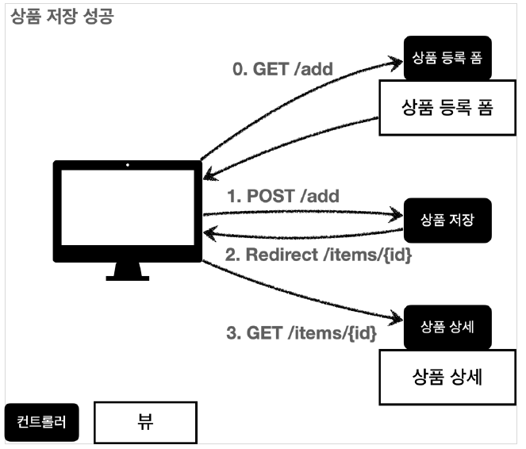
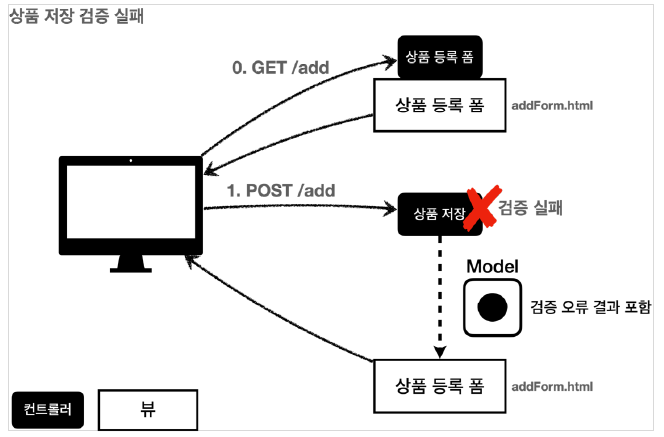

# Validation

검증 요구사항

+ 타입 검증
  + 가격, 수량에 문자가 들어가면 검증 오류 처리
+ 필드 검증
  + 상품명: 필수, 공백X
  + 가격: 1000원 이상, 1백만원 이하
  + 수량: 최대 9999
+ 특정 필드의 범위를 넘어서는 검증
  + 가격 * 수량의 합은 10,000원 이상

---

## 검증 직접 처리



사용자가 정상 범위의 데이터를 입력하면, 서버에서는 검증 로직이 통과하여 저장하고 상세화면으로 redirect 한다.



정상 범위의 데이터를 입력하지 않으면 서버 검증 로직이 실패해야 한다. 검증에 실패한 경우 다시 상품 등록 폼을 보여주고, 어떤 값을 잘못 입력했는지 알려주어야 한다.

---

## 검증 직접 처리 - 개발

ValidationItemControllerV1 - addItem() 수정

```java
    @PostMapping("/add")
    public String addItem(@ModelAttribute Item item, RedirectAttributes redirectAttributes, Model model) {

        //검증 오류 결과를 보관
        Map<String, String> errors = new HashMap<>();

        //검증 로직
        if (!StringUtils.hasText(item.getItemName())) {
            errors.put("itemName", "상품 이름은 필수입니다.");
        }

        if (item.getPrice() == null || item.getPrice() < 1000 || item.getPrice() > 1000000) {
            errors.put("price", "가격은 1,000 ~ 1,000,000 까지 허용합니다.");
        }
        if (item.getQuantity() == null || item.getQuantity() >= 9999) {
            errors.put("quantity", "수량은 최대 9,999 까지 허용합니다.");
        }

        if (item.getPrice() != null && item.getQuantity() != null) {
            int resultPrice = item.getPrice() * item.getQuantity();

            if (resultPrice < 10000) {
                errors.put("globalError", "가격 * 수량의 합은 10,000원 이상이어야 합니다. 현재 값 = " + resultPrice);
            }
        }

        if (!errors.isEmpty()) {
            log.info("errors = {}", errors);
            model.addAttribute("errors",errors);
            return "validation/v1/addForm";
        }

        Item savedItem = itemRepository.save(item);
        redirectAttributes.addAttribute("itemId", savedItem.getId());
        redirectAttributes.addAttribute("status", true);
        return "redirect:/validation/v1/items/{itemId}";
    }
```


`Map<String, String> errors = new HashMap<>();` 검증시에 오류가 발생하면 오류 정보를 담아둘 errors

```java
    if (!StringUtils.hasText(item.getItemName())) {
            errors.put("itemName", "상품 이름은 필수입니다.");
        }

        if (item.getPrice() == null || item.getPrice() < 1000 || item.getPrice() > 1000000) {
            errors.put("price", "가격은 1,000 ~ 1,000,000 까지 허용합니다.");
        }
        if (item.getQuantity() == null || item.getQuantity() >= 9999) {
            errors.put("quantity", "수량은 최대 9,999 까지 허용합니다.");
        }
```

상품이름, 가격, 수량에 대한 검증 실패시 errors에 put

```java
        if (item.getPrice() != null && item.getQuantity() != null) {
            int resultPrice = item.getPrice() * item.getQuantity();

            if (resultPrice < 10000) {
                errors.put("globalError", "가격 * 수량의 합은 10,000원 이상이어야 합니다. 현재 값 = " + resultPrice);
            }
        }
```

특정 필드의 검증실패가 아닌 오류 처리를 위한 `globalerror`를 key로 사용하여 저장

```java
        if (!errors.isEmpty()) {
            log.info("errors = {}", errors);
            model.addAttribute("errors",errors);
            return "validation/v1/addForm";
        }
```

검증 실패시 model에 errors를 담아서 addForm으로 보낸다.


```html
        <div th:if="${errors?.containsKey('globalError')}">
            <p class="field-error" th:text="${errors.get('globalError')}">전체 오류 메시지</p>
        </div>

        <div>
            <label for="itemName" th:text="#{label.item.itemName}">상품명</label>
            <input type="text" id="itemName" th:field="*{itemName}"
                   th:class="${errors?.containsKey('itemName')} ? 'form-control field-error' : 'form-control'"
                   class="form-control" placeholder="이름을 입력하세요">
            <div class="field-error" th:if="${errors?.containsKey('itemName')}" th:text="${errors['itemName']}">
                상품명 오류
            </div>
        </div>
```

```html
<div th:if="${errors?.containsKey('globalError')}">
            <p class="field-error" th:text="${errors.get('globalError')}">전체 오류 메시지</p>
        </div>
```

`th:if="${errors?.containsKey('globalError')}"`는 errors에 `globalError`가 key로 있을때만 출력된다. 

> Safe Navigation Operation
> 
> 만약 여기서 erorrs가 null이라면 `errors.containsKey()`를 호출하는 시점에 NullPointerException이 발생한다.
> 
> `errors?.`는 errors가 null이면 NullPointerException을 발생시키는 대신 null을 반환한다.
> 
> 그렇기 때문에 if문은 null을 실패로 처리하고 메시지를 출력하지 않는다.


### 정리

+ 만약 검증 오류가 발생하면 입력 폼을 다시 보여준다.
+ 검증 오류들을 보여주고 다시 입력할 수 있게 한다.
+ 검증 오류가 발생해도 고객이 입력한 데이터가 유지된다.

#### 데이터가 유지될 수 있는 이유

```java
@PostMapping("/add")
public String addItem(@ModelAttribute Item item, RedirectAttributes redirectAttributes, Model model) {}
```

`@PostMapping`에서 파라미터로 `@ModelAttribute Item item`을 객체로 받는다.

로직을 수행하고 addForm 뷰 템플릿으로 보내는데 addForm에선 `th:object`로 Item 객체를 받고 그 값들로 `<input type="text" id="itemName" th:field="*{itemName}"`로 사용하여 뿌리고 있다.

그래서 검증이 실패하고 다시 addForm 뷰를 받으면 입력했던 값들이 그대로 보이게 된다.


### 남은 문제점

+ 뷰 템플릿에서 중복 처리가 너무 많다.
+ 타입 오류 처리를 해결하지 못했다. Integer타입인 수량, 가격에 문자를 넣으면 서버는 `400Error`를 반환한다.
+ 가격에 문자를 입력해도 입력했던 문자를 보여주고 싶어도 Item 객체에 바인딩이 되지 않아 보관할 수가 없다. 
+ 결국 검증에 실패한 문자도 어딘가에 별도로 관리가 되어야 한다.

---

## BindingResult1

스프링이 제공하는 검증 오류 처리 방법

---

BindingResult

```java
    @PostMapping("/add")
    public String addItemV1(@ModelAttribute Item item, BindingResult bindingResult, RedirectAttributes redirectAttributes) {


        if (!StringUtils.hasText(item.getItemName())) {
            bindingResult.addError(new FieldError("item","itemName","상품 이름은 필수입니다."));
        }

        if (item.getPrice() == null || item.getPrice() < 1000 || item.getPrice() > 1000000) {
            bindingResult.addError(new FieldError("item","price","가격은 1,000 ~ 1,000,000 까지 허용합니다."));

        }
        if (item.getQuantity() == null || item.getQuantity() >= 9999) {
            bindingResult.addError(new FieldError("item","quantity","수량은 최대 9,999 까지 허용합니다."));
        }

        if (item.getPrice() != null && item.getQuantity() != null) {
            int resultPrice = item.getPrice() * item.getQuantity();

            if (resultPrice < 10000) {
                bindingResult.addError(new ObjectError("item","가격 * 수량의 합은 10,000원 이상이어야 합니다. 현재 값 = " + resultPrice));
            }
        }

        if (bindingResult.hasErrors()) {
            log.info("errors = {}", bindingResult);

            return "validation/v2/addForm";
        }

        Item savedItem = itemRepository.save(item);
        redirectAttributes.addAttribute("itemId", savedItem.getId());
        redirectAttributes.addAttribute("status", true);
        return "redirect:/validation/v2/items/{itemId}";
    }
```

`BindingResult`는 `@ModelAttribute Item item` 다음에 위치해야 한다.

### 필드 오류 - FieldError

필드 오류는 `FieldError`라는 객체 안에 (`오브젝트이름`,`필드이름`,`에러 메시지`)를 담는다.

`bindResult.addError(new FieldError("item", "itemName", "상품 이름은 필수입니다."));`

+ objectName: `@ModelAttribute`이름
+ field: 오류가 발생한 필드 이름
+ defaultMessage: 오류 기본 메시지

### 글로벌 오류 - ObjectError

글로벌 오류는 `ObjectError`라는 객체 안에 (`오브젝트이름`,`에러 메시지`)를 담는다.

`bindingResult.addError(new ObjectError("item","가격 * 수량의 합은 10,000원 이상이어야 합니다. 현재 값 = " + resultPrice));`

+ objectName: `@ModelAttribute`이름
+ defaultMessage: 오류 기본 메시지

```html
<!DOCTYPE HTML>
<html xmlns:th="http://www.thymeleaf.org">
<head>
    <meta charset="utf-8">
    <link th:href="@{/css/bootstrap.min.css}"
          href="../css/bootstrap.min.css" rel="stylesheet">
    <style>
        .container {
            max-width: 560px;
        }
        .field-error {
            border-color: #dc3545;
            color: #dc3545;
        }
    </style>
</head>
<body>

<div class="container">

    <div class="py-5 text-center">
        <h2 th:text="#{page.addItem}">상품 등록</h2>
    </div>

    <form action="item.html" th:action th:object="${item}" method="post">

        <div th:if="${#fields.hasGlobalErrors()}">
            <p class="field-error" th:each="err : ${#fields.globalErrors()}" th:text="${err}">글로벌 오류 메시지</p>
        </div>

        <div>
            <label for="itemName" th:text="#{label.item.itemName}">상품명</label>
            <input type="text" id="itemName" th:field="*{itemName}"
                   th:errorclass="field-error" class="form-control" placeholder="이름을 입력하세요">
            <div class="field-error" th:errors="*{itemName}">
                상품명 오류
            </div>
        </div>
        <div>
            <label for="price" th:text="#{label.item.price}">가격</label>
            <input type="text" id="price" th:field="*{price}"
                   th:errorclass="field-error" class="form-control" placeholder="가격을 입력하세요">
            <div class="field-error" th:errors="*{price}">
                가격 오류
            </div>
        </div>
        <div>
            <label for="quantity" th:text="#{label.item.quantity}">수량</label>
            <input type="text" id="quantity" th:field="*{quantity}"
                   th:errorclass="field-error" class="form-control" placeholder="수량을 입력하세요">
            <div class="field-error" th:errors="*{quantity}">
                수량 오류
            </div>

        </div>

        <hr class="my-4">

        <div class="row">
            <div class="col">
                <button class="w-100 btn btn-primary btn-lg" type="submit" th:text="#{button.save}">상품 등록</button>
            </div>
            <div class="col">
                <button class="w-100 btn btn-secondary btn-lg"
                        onclick="location.href='items.html'"
                        th:onclick="|location.href='@{/validation/v2/items}'|"
                        type="button" th:text="#{button.cancel}">취소</button>
            </div>
        </div>

    </form>

</div> <!-- /container -->
</body>
</html>
```

### 타임리프 스프링 검증 오류 통합 기능

타임리프는 스프링의 `BindingResult`를 활용해서 편리하게 검증 오류를 표현하는 기능을 제공한다.

+ `#fields`: `#fields`로 `BindingResult`가 제공하는 검증 오류에 접근할 수 있다.
+ `th:errors`: 해당 필드에 오류가 있는 경우 오류 메시지를 출력한다. `th:if`의 편의 버전
+ `th:errorclass`: `th:field`에서 지정한 필드에 오류가 있으면 `class`정보를 추가한다.
  + `th:classappend`같은 효과를 가진다.


---

## BindingResult2

+ `BindingResult`는 스프링이 제공하는 검증 오류를 보관하는 객체
+ `BindingResult`가 있으면 `@ModelAttribute`에 데이터 바인딩 시 오류가 발생해도 컨트롤러가 호출된다.

---

### @ModelAttribute에 바인딩 타입 오류가 발생하면?

+ `BindingResult`가 없으면 -> 400 오류 발생 컨트롤러 호출 X
+ `BindingResult`가 있으면 -> 오류 정보(FieldError)를 BindingResult에 담아서 컨트롤러 정상 호출


### BindingResult에 검증 오류를 적용하는 3가지 방법

+ @ModelAttribute의 객체에 바인딩이 실패하는 경우 `FieldError`를 생성해서 `BindingResult`에 넣어줌
+ 개발자가 직접 넣어줌
+ `Validator`사용

---

## FieldError, ObjectError

사용자 입력 메시지가 화면에 남아있도록 만들어보자.

```java
    @PostMapping("/add")
    public String addItemV2(@ModelAttribute Item item, BindingResult bindingResult, RedirectAttributes redirectAttributes) {


        if (!StringUtils.hasText(item.getItemName())) {
            bindingResult.addError(new FieldError("item","itemName",item.getItemName(),false,null,null,"상품 이름은 필수입니다."));
        }

        if (item.getPrice() == null || item.getPrice() < 1000 || item.getPrice() > 1000000) {
            bindingResult.addError(new FieldError("item","price",item.getPrice(),false,null,null,"가격은 1,000 ~ 1,000,000 까지 허용합니다."));

        }
        if (item.getQuantity() == null || item.getQuantity() >= 9999) {
            bindingResult.addError(new FieldError("item","quantity",item.getQuantity(),false,null,null,"수량은 최대 9,999 까지 허용합니다."));
        }

        if (item.getPrice() != null && item.getQuantity() != null) {
            int resultPrice = item.getPrice() * item.getQuantity();

            if (resultPrice < 10000) {
                bindingResult.addError(new ObjectError("item",null,null,"가격 * 수량의 합은 10,000원 이상이어야 합니다. 현재 값 = " + resultPrice));
            }
        }

        if (bindingResult.hasErrors()) {
            log.info("errors = {}", bindingResult);

            return "validation/v2/addForm";
        }

        Item savedItem = itemRepository.save(item);
        redirectAttributes.addAttribute("itemId", savedItem.getId());
        redirectAttributes.addAttribute("status", true);
        return "redirect:/validation/v2/items/{itemId}";
    }
```

FieldError 생성자는 두가지 이다.

```text
public FieldError(String objectName, String field, String defaultMessage);

public FieldError(String objectName, String field, @Nullable Object 
rejectedValue, boolean bindingFailure, @Nullable String[] codes, @Nullable
Object[] arguments, @Nullable String defaultMessage)
```

+ `objectName`: 오류가 발생한 객체 이름 
+ `field`: 오류 필드
+ `rejectedValue`: 사용자가 입력한 값
+ `bindingFailure`: 타입 오류 같은 바인딩 실패인지, 검증 실패인지 구분하는 값
+ `codes`: 메시지 코드
+ `arguments`: 메시지에서 사용하는 인자
+ `defaultMessage`: 기본 오류 메시지

`rejectedValue`에 사용자가 입력한 값을 담아주면 화면에 다시 출력해 줄 수 있다.

`th:field="*{price}"`

타임리프의 `th:field`는 정상 상황에서는 모델 객체의 값을 사용하지만, 오류가 발생하면 `FieldError`에서 보관한 값을 사용해서 값을 출력해준다.

---

## 오류 코드와 메시지 처리1

`FieldError`와 `ObjectError`의 생성자중 `errorCode`,`arguments`를 사용하면 오류 발생시 오류 코드로 메시지리를 처리할 수 있다.

---

### errors 메시지 파일 생성

resources/errors.properties

```text
required.item.itemName=상품 이름은 필수입니다.
range.item.price=가격은 {0} ~ {1} 까지 허용합니다.
max.item.quantity=수량은 최대 {0} 까지 허용합니다.
totalPriceMin=가격 * 수량의 합은 {0}원 이상이어야 합니다. 현재 값 = {1}
```

application.properties

`spring.messages.basename=messages,errors`

위처럼 basename을 지정하면 스프링이 두 파일을 모두 인식할 수 있다.

```java
    @PostMapping("/add")
    public String addItemV3(@ModelAttribute Item item, BindingResult bindingResult, RedirectAttributes redirectAttributes) {


        if (!StringUtils.hasText(item.getItemName())) {
            bindingResult.addError(new FieldError("item","itemName",item.getItemName(),false,new String[]{"required.item.itemName"},null,null));
        }

        if (item.getPrice() == null || item.getPrice() < 1000 || item.getPrice() > 1000000) {
            bindingResult.addError(new FieldError("item","price",item.getPrice(),false,new String[]{"range.item.price"},new Object[]{1000,1000000},null));

        }
        if (item.getQuantity() == null || item.getQuantity() >= 9999) {
            bindingResult.addError(new FieldError("item","quantity",item.getQuantity(),false,new String[]{"max.item.quantity"},new Object[]{9999},null));
        }

        if (item.getPrice() != null && item.getQuantity() != null) {
            int resultPrice = item.getPrice() * item.getQuantity();

            if (resultPrice < 10000) {
                bindingResult.addError(new ObjectError("item",new String[]{"totalPriceMin"},new Object[]{10000,resultPrice},null));
            }
        }

        if (bindingResult.hasErrors()) {
            log.info("errors = {}", bindingResult);

            return "validation/v2/addForm";
        }

        Item savedItem = itemRepository.save(item);
        redirectAttributes.addAttribute("itemId", savedItem.getId());
        redirectAttributes.addAttribute("status", true);
        return "redirect:/validation/v2/items/{itemId}";
    }
```

`codes`: errors.properties 의 메시지 코드를 `String[]`의 형태로 전달한다.

`arguments`: `Object[]`의 형태로 치환할 값을 전달한다.


---


## 오류 코드와 메시지 처리2

번거로운 `FieldError`,`ObjectError`를 다른방법으로 사용해보기

---

컨트롤러에서 `BindingResult`는 이미 검증해야 할 객체를 이미 알고있다.

```text
log.info("objectName={}", bindingResult.getObjectName());
log.info("target={}", bindingResult.getTarget());
```

```text
objectName=item
target=Item(id=null, itemName=, price=null, quantity=null)
```

즉 BindingResult는 Target과 ObjectName을 가지고 있다.

이를 이용하면 코드를 더 줄일 수 있다.

### `rejectvalue()`, `reject()`

`BindingResult`가 제공하는 `rejectValue()`,`reject()`를 사용하면 `FieldError`,`ObjectError`를 직접 생성하지 않고 깔끔하게 다룰 수 있다.


```java
 @PostMapping("/add")
    public String addItemV4(@ModelAttribute Item item, BindingResult bindingResult, RedirectAttributes redirectAttributes) {

        log.info("objectName={}", bindingResult.getObjectName());
        log.info("target={}", bindingResult.getTarget());

        if (!StringUtils.hasText(item.getItemName())) {
            bindingResult.rejectValue("itemName","required");
        }

        if (item.getPrice() == null || item.getPrice() < 1000 || item.getPrice() > 1000000) {
            bindingResult.rejectValue("price","range",new Object[]{1000,1000000},null);

        }
        if (item.getQuantity() == null || item.getQuantity() >= 9999) {
            bindingResult.rejectValue("quantity","max",new Object[]{9999},null);
        }

        if (item.getPrice() != null && item.getQuantity() != null) {
            int resultPrice = item.getPrice() * item.getQuantity();

            if (resultPrice < 10000) {
                bindingResult.reject("totalPriceMin",new Object[]{10000,resultPrice},null);
            }
        }

        if (bindingResult.hasErrors()) {
            log.info("errors = {}", bindingResult);

            return "validation/v2/addForm";
        }

        Item savedItem = itemRepository.save(item);
        redirectAttributes.addAttribute("itemId", savedItem.getId());
        redirectAttributes.addAttribute("status", true);
        return "redirect:/validation/v2/items/{itemId}";
    }
```

### rejectValue()

```java
void rejectValue(@Nullable String field, String errorCode,
@Nullable Object[] errorArgs, @Nullable String defaultMessage);
```

+ field: 오류 필드명
+ errorCode: 오류 코드(메시지에 등록된 코드가 아님)
+ errorArgs: 치환하기 위한 값
+ defaultMessage: 오류 메시지를 찾을 수 없을때 사용하는 기본 메시지


```java
bindingResult.rejectValue("price","range",new Object[]{1000,1000000},null);
```

BindingReulst는 이미 target을 알고 있기 때문에 target(item)에 대한 정보는 없어도 된다.


### reject()

글로벌 오류 발생시 사용한다.

---

## 오류 코드와 메시지 처리3

오류 메시지 코드를 만들 때 자세하게 만들 수도 있고 단순하게 만들 수 도있다.


`required.item.itemName`, `required`

단순하게 만들면 범용성이 좋지만 세밀하게 작성하기 어렵다. 

범용성으로 사용하다가, 세밀하게 작성해야 하는 경우 세밀한 내용이 적용되도록 단계를 두는 방법이 제일 좋은 방법이다.

```text
required.item.itemName=상품 이름은 필수 입니다.

required=필수 값 입니다.
```

객체명과 필드명을 조합한 메시지가 있는지 우선 확인하고 없으면 범용적인 메시지를 선택하도록 스프링은 `MessageCodesResolver`를 지원한다.


---


## 오류 코드와 메시지 처리4

---


### MessageCodesResolver

+ 검증 오류 코드로 메시지 코드들을 생성한다.
+ `MessageCodesResolver` 인터페이스이고 `DefaultMessageCodesResolver`는 기본 구현체이다.


### DefaultMessageCodesResolver의 생성 규칙

**객체 오류**

```text
1: code + "." + object name
2: code

ex) 오류 코드: required, object name: item
1: required.item
2: required
```

**필드 오류**

```text
1: code + "." + object name + "." + field
2: code + "." + field
3: code + "." + field type
4: code

ex) 오류 코드: typeMismatch, object name: user, field: age, field type: int
1: typeMismatch.user.age
2: typeMismatch.age
3: typeMismatch.int
4: typeMismatch
```

`rejectValue()`, `reject()`는 내부에서 `MessageCodesResolver`를 사용한다. 여기에서 메시지 코드들을 생성한다.


타임리프가 렌더링 할 때는 `th:errors`가 실행되고 이때 오류가 있다면 메시지 코드를 순서대로 돌아가면서 메시지를 찾은 뒤 없으면 디폴트 메시지를 출력한다.

---

## 오류 코드와 메시지 처리5

모든 오류 코드에 대해서 메시지를 각각 다 정의하면 개발자 입장에서 관리하기 힘들다.

크게 중요하지 않은 메시지는 범용성 있는 `required`같은 메시지로 끝내고, 중요한 메시지는 구체적으로 적어서 사용하는 방식이 더 효과적이다.

---

```text
#required.item.itemName=상품 이름은 필수입니다.
#range.item.price=가격은 {0} ~ {1} 까지 허용합니다.
#max.item.quantity=수량은 최대 {0} 까지 허용합니다.
#totalPriceMin=가격 * 수량의 합은 {0}원 이상이어야 합니다. 현재 값 = {1}

#==ObjectError==
#Level1
totalPriceMin.item=상품의 가격 * 수량의 합은 {0}원 이상이어야 합니다. 현재 값 = {1}

#Level2 - 생략
totalPriceMin=전체 가격은 {0}원 이상이어야 합니다. 현재 값 = {1}


#==FieldError==
#Level1
required.item.itemName=상품 이름은 필수입니다.
range.item.price=가격은 {0} ~ {1} 까지 허용합니다.
max.item.quantity=수량은 최대 {0} 까지 허용합니다.

#Level2 - 생략

#Level3
required.java.lang.String = 필수 문자입니다.
required.java.lang.Integer = 필수 숫자입니다.
min.java.lang.String = {0} 이상의 문자를 입력해주세요.
min.java.lang.Integer = {0} 이상의 숫자를 입력해주세요.
range.java.lang.String = {0} ~ {1} 까지의 문자를 입력해주세요.
range.java.lang.Integer = {0} ~ {1} 까지의 숫자를 입력해주세요.
max.java.lang.String = {0} 까지의 문자를 허용합니다.
max.java.lang.Integer = {0} 까지의 숫자를 허용합니다.

#Level4
required = 필수 값 입니다.
min= {0} 이상이어야 합니다.
range= {0} ~ {1} 범위를 허용합니다.
max= {0} 까지 허용합니다.
```

### 정리

rejectValue()를 호출하면 MessageCodesResolver에서 검증 오류 코드로 메시지 코드들을 생성하고 new FieldError()를 생성하면서 메시지 코드들을 보관한다.

th:errors에서 메시지 코드들로 메시지를 순서대로 메시지에서 찾고 노출 시킨다.

---

## 오류 코드와 메시지 처리6

addForm에서 `price` 필드에 문자 "A"를 입력하면

codes들을 확인할 수 있다.

`codes [typeMismatch.item.price,typeMismatch.price,typeMismatch.java.lang.Integer,typeMismatch]`

스프링은 타입 오류가 발생하면 `typeMismatch`라는 오류 코드를 사용한다.

이 오류 코드들은 `MessageCodesResolver`를 통하면서 4가지 메서드 코드가 생성된다.

errors.properteis에 `typeMismatch`에 관련된 메시지를 설정하지 않아서 자동으로 생성된 defaultMessage가 출력된다

```text
typeMismatch.java.lang.Integer=숫자를 입력해주세요.
typeMismatch=타입 오류입니다.
```

errors.properties에 위 메시지를 추가하면 웹 페이지에서 메시지 코드를 찾아서 출력해준다.