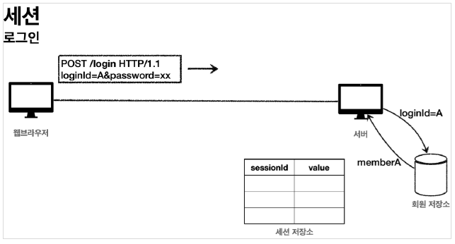
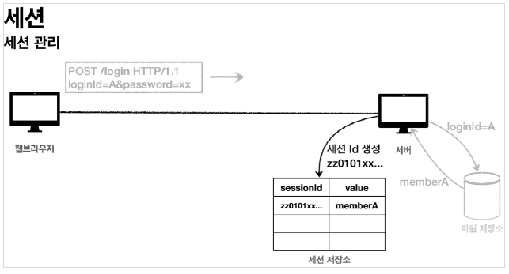
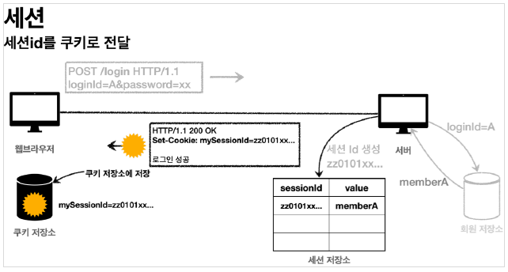
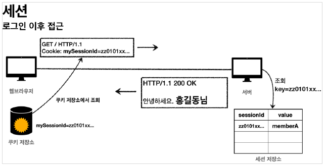

# 로그인 처리 - 쿠키, 세션

---

## 패키지 구조 설계

+ hello.login
    + domain
        + item
        + member
        + login
    + web
        + item
        + member
        + login

도메인 = 화면, UI, 기술 인프라 등등의 영역은 제외한 시스템이 구현해야 하는 핵심 비즈니스 업무 영역

향후 web을 다른 기술로 바꾸어도 도메인은 그대로 유지할 수 있어야 한다.

즉 web은 domain을 알고있지만 domain은 web을 모르도록 설계해야 한다.

**domian**은 **web**을 참조하면 안된다.


---

## 홈 화면

web/HomeController

```java

@Slf4j
@Controller
public class HomeController {

    @GetMapping("/")
    public String home() {
        return "home";
    }
}
```

home.html

```html
<!DOCTYPE HTML>
<html xmlns:th="http://www.thymeleaf.org">
<head>
    <meta charset="utf-8">
    <link th:href="@{/css/bootstrap.min.css}"
          href="css/bootstrap.min.css" rel="stylesheet">
</head>
<body>
<div class="container" style="max-width: 600px">
    <div class="py-5 text-center">
        <h2>홈 화면</h2>
    </div>
    <div class="row">
        <div class="col">
            <button class="w-100 btn btn-secondary btn-lg" type="button"
                    th:onclick="|location.href='@{/members/add}'|">
                회원 가입
            </button>
        </div>
        <div class="col">
            <button class="w-100 btn btn-dark btn-lg"
                    onclick="location.href='items.html'"
                    th:onclick="|location.href='@{/login}'|" type="button">
                로그인
            </button>
        </div>
    </div>
    <hr class="my-4">
</div> <!-- /container -->
</body>
</html>
```

---

## 회원 가입

member/Member

```java

@Data
public class Member {

    private Long id;

    @NotEmpty
    private String loginId; //로그인 ID
    @NotEmpty
    private String name;
    @NotEmpty
    private String password;

}
```

member/MemberRepository

```java

@Slf4j
@Repository
public class MemberRepository {

    private static Map<Long, Member> store = new HashMap<>();
    private static long sequence = 0L;

    public Member save(Member member) {
        member.setId(++sequence);
        log.info("save: member={}", member);
        store.put(member.getId(), member);
        return member;
    }

    public Member findById(Long id) {
        return store.get(id);
    }

    public Optional<Member> findByLoginId(String loginId) {
        List<Member> all = findAll();

        /*for (Member m : all) {
           if(m.getLoginId().equals(loginId)){
               return m;
           }
        }
        return null;*/

        /*for (Member m : all) {
            if(m.getLoginId().equals(loginId)){
                return Optional.of(m);
            }
        }
        return Optional.empty();*/

        return findAll().stream()
                .filter(m -> m.getLoginId().equals(loginId))
                .findFirst();
    }

    public List<Member> findAll() {
        return new ArrayList<>(store.values());
    }

    public void clearStore() {
        store.clear();
    }

}
```

web/member/memberController

```java

@Controller
@RequiredArgsConstructor
@RequestMapping("/members")
public class MemberController {

    private final MemberRepository memberRepository;

    @GetMapping("/add")
    public String addForm(@ModelAttribute("member") Member member) {
        return "members/addMemberForm";
    }

    @PostMapping("/add")
    public String save(@Validated @ModelAttribute Member member, BindingResult bindingResult) {
        if (bindingResult.hasErrors()) {
            return "members/addMemberForm";
        }

        memberRepository.save(member);
        return "redirect:/";
    }
}
```

templates/members/addMemberForm.html

```html
<!DOCTYPE HTML>
<html xmlns:th="http://www.thymeleaf.org">
<head>
    <meta charset="utf-8">
    <link th:href="@{/css/bootstrap.min.css}"
          href="../css/bootstrap.min.css" rel="stylesheet">
    <style>
        .container {
            max-width: 560px;
        }

        .field-error {
            border-color: #dc3545;
            color: #dc3545;
        }
    </style>
</head>
<body>
<div class="container">
    <div class="py-5 text-center">
        <h2>회원 가입</h2>
    </div>
    <h4 class="mb-3">회원 정보 입력</h4>
    <form action="" th:action th:object="${member}" method="post">
        <div th:if="${#fields.hasGlobalErrors()}">
            <p class="field-error" th:each="err : ${#fields.globalErrors()}"
               th:text="${err}">전체 오류 메시지</p>
        </div>
        <div>
            <label for="loginId">로그인 ID</label>
            <input type="text" id="loginId" th:field="*{loginId}" class="form-control"
                   th:errorclass="field-error">
            <div class="field-error" th:errors="*{loginId}"/>
        </div>
        <div>
            <label for="password">비밀번호</label>
            <input type="password" id="password" th:field="*{password}"
                   class="form-control"
                   th:errorclass="field-error">
            <div class="field-error" th:errors="*{password}"/>
        </div>
        <div>
            <label for="name">이름</label>
            <input type="text" id="name" th:field="*{name}" class="form-control"
                   th:errorclass="field-error">
            <div class="field-error" th:errors="*{name}"/>
        </div>
        <hr class="my-4">
        <div class="row">
            <div class="col">
                <button class="w-100 btn btn-primary btn-lg" type="submit">회원
                    가입
                </button>
            </div>
            <div class="col">
                <button class="w-100 btn btn-secondary btn-lg"
                        onclick="location.href='items.html'"
                        th:onclick="|location.href='@{/}'|"
                        type="button">취소
                </button>
            </div>
        </div>
    </form>
</div> <!-- /container -->
</body>
</html>
```

---

## 로그인 기능

domain/login/LoginService

```java

@Service
@RequiredArgsConstructor
public class LoginService {

    private final MemberRepository memberRepository;


    /**
     * @return null 로그인 실패
     */
    public Member login(String loginId, String password) {
       /* Optional<Member> findMemberOptional = memberRepository.findByLoginId(loginId);
        Member member = findMemberOptional.get();

        if(member.getPassword().equals(password)){
            return member;
        }else{
            return null;
        }*/

//        Optional<Member> byLoginId = memberRepository.findByLoginId(loginId);

        return memberRepository.findByLoginId(loginId)
                .filter(m -> m.getPassword().equals(password))
                .orElse(null);
    }
}
```

로그인 처리 비즈니스 로직. 파라미터로 넘어온 loginId로 회원을 조회하고 password와 맞으면 Member 객체를 반환하고 다르면 null을 반환한다.

web/login/LoginForm

```java

@Data
public class LoginForm {

    @NotEmpty
    private String loginId;

    @NotEmpty
    private String password;
}
```

web/login/LoginController

```java

@Controller
@RequiredArgsConstructor
public class LoginController {

    private final LoginService loginService;

    @GetMapping("/login")
    public String loginForm(@ModelAttribute("loginForm") LoginForm form) {
        return "login/loginForm";
    }


    @PostMapping("/login")
    public String login(@Validated @ModelAttribute LoginForm form, BindingResult bindingResult) {

        if (bindingResult.hasErrors()) {
            return "/login/loginForm";
        }

        Member loginMember = loginService.login(form.getLoginId(), form.getPassword());


        if (loginMember == null) {
            bindingResult.reject("loginFail", "아이디 또는 비밀번호가 맞지 않습니다.");
            return "login/loginForm";
        }

        //로그인 성공 처리 TODO

        return "redirect:/";
    }
}

```

templates/login/loginForm.html

```html
<!DOCTYPE HTML>
<html xmlns:th="http://www.thymeleaf.org">
<head>
    <meta charset="utf-8">
    <link th:href="@{/css/bootstrap.min.css}"
          href="../css/bootstrap.min.css" rel="stylesheet">
    <style>
        .container {
            max-width: 560px;
        }

        .field-error {
            border-color: #dc3545;
            color: #dc3545;
        }
    </style>
</head>
<body>
<div class="container">
    <div class="py-5 text-center">
        <h2>로그인</h2>
    </div>
    <form action="item.html" th:action th:object="${loginForm}" method="post">
        <div th:if="${#fields.hasGlobalErrors()}">
            <p class="field-error" th:each="err : ${#fields.globalErrors()}"
               th:text="${err}">전체 오류 메시지</p>
        </div>
        <div>
            <label for="loginId">로그인 ID</label>
            <input type="text" id="loginId" th:field="*{loginId}" class="form-control"
                   th:errorclass="field-error">
            <div class="field-error" th:errors="*{loginId}"/>
        </div>
        <div>
            <label for="password">비밀번호</label>
            <input type="password" id="password" th:field="*{password}"
                   class="form-control"
                   th:errorclass="field-error">
            <div class="field-error" th:errors="*{password}"/>
        </div>
        <hr class="my-4">
        <div class="row">
            <div class="col">
                <button class="w-100 btn btn-primary btn-lg" type="submit">
                    로그인
                </button>
            </div>
            <div class="col">
                <button class="w-100 btn btn-secondary btn-lg"
                        onclick="location.href='items.html'"
                        th:onclick="|location.href='@{/}'|"
                        type="button">취소
                </button>
            </div>
        </div>
    </form>
</div> <!-- /container -->
</body>
</html>
```

---

## 로그인 처리하기 - 쿠키 사용

---

### 로그인 상태 유지하기

웹 브라우저와 서버 사이에선 로그인 상태를 알고 있어야 한다.

이 때 **쿠키**를 사용한다.

서버에서 로그인에 성공하면 HTTP 응답에 쿠키를 담아서 브라우저에 전달한다. 그러면 브라우저는 앞으로 해당 쿠키를 지속적으로 보내준다.

### 쿠키에는 영속 쿠키와 세션 쿠키가 있다.

+ 영속 쿠키: 만료 날짜를 입력하면 해당 날짜까지 유지
+ 세션 쿠키: 만료 날짜를 생략하면 브라우저 종료시 까지만 유지

```java
    @PostMapping("/login")
public String login(@Validated @ModelAttribute LoginForm form,BindingResult bindingResult,HttpServletResponse response){

        if(bindingResult.hasErrors()){
        return"/login/loginForm";
        }

        Member loginMember=loginService.login(form.getLoginId(),form.getPassword());


        if(loginMember==null){
        bindingResult.reject("loginFail","아이디 또는 비밀번호가 맞지 않습니다.");
        return"login/loginForm";
        }

        //로그인 성공 처리
        //쿠키에 시간 정보를 주지 않으면 세션 쿠키
        Cookie idCookie=new Cookie("memberId",String.valueOf(loginMember.getId()));
        response.addCookie(idCookie);


        return"redirect:/";
        }
```

```java
 Cookie idCookie=new Cookie("memberId",String.valueOf(loginMember.getId()));
        response.addCookie(idCookie);
```

로그인에 성공하면 쿠키를 생성하여 `HttpServletResponse`에 담는다.

```java
    @GetMapping("/")
public String homeLogin(@CookieValue(name = "memberId", required = false)Long memberId,Model model){
        if(memberId==null){
        return"home";
        }

        Member loginMember=memberRepository.findById(memberId);
        if(loginMember==null){
        return"home";
        }

        model.addAttribute("member",loginMember);
        return"loginHome";
        }
```

`@CookieValue`를 사용하면 쿠키를 편리하게 조회할 수 있다.

로그인하지 않은 사용자를 위해 `required = false`로 설정한다.

```html
<!DOCTYPE HTML>
<html xmlns:th="http://www.thymeleaf.org">
<head>
    <meta charset="utf-8">
    <link th:href="@{/css/bootstrap.min.css}"
          href="../css/bootstrap.min.css" rel="stylesheet">
</head>
<body>
<div class="container" style="max-width: 600px">
    <div class="py-5 text-center">
        <h2>홈 화면</h2>
    </div>
    <h4 class="mb-3" th:text="|로그인: ${member.name}|">로그인 사용자 이름</h4>
    <hr class="my-4">
    <div class="row">
        <div class="col">
            <button class="w-100 btn btn-secondary btn-lg" type="button"
                    th:onclick="|location.href='@{/items}'|">
                상품 관리
            </button>
        </div>
        <div class="col">
            <form th:action="@{/logout}" method="post">
                <button class="w-100 btn btn-dark btn-lg"
                        onclick="location.href='items.html'" type="submit">
                    로그아웃
                </button>
            </form>
        </div>
    </div>
    <hr class="my-4">
</div> <!-- /container -->
</body>
</html>
```

`th:text="|로그인: ${member.name}|"` 코드로 인해 로그인에 성공한 사용자의 이름을 출력할 수 있다.

```java
    @PostMapping("/logout")
public String logout(HttpServletResponse response){
        expireCookie(response,"memberId");
        return"redirect:/";
        }

private void expireCookie(HttpServletResponse response,String cookieName){
        Cookie cookie=new Cookie(cookieName,null);
        cookie.setMaxAge(0);
        response.addCookie(cookie);
        }
```

로그아웃을 POST로 요청하면 서버는 쿠키의 종료 날짜를 0으로 지정해서 응답한다.

---

## 쿠키와 보안 문제

---

### 보안 문제

+ 쿠키 값은 임의로 변경할 수 있다.
+ 쿠키에 보관된 정보는 훔쳐갈 수 있다.
+ 해커가 쿠키를 한번 훔쳐가면 평생 사용할 수 있다.

### 대안

+ 쿠키에 중요한 값을 노출하지 않고, 예측 불가능한 임의의 토큰값을 노출하여 서버에서는 토큰과 사용자 id를 매칭해서 인식한다.
+ 서버에서 해당 토큰의 만료시간을 짧게 유지하고 해킹이 의심되는 경우 서버에서 토큰을 강제로 제거하면 된다.

---

## 로그인 처리하기 - 세션 동작 방식

쿠키의 문제점을 해결하려면 중요한 정보를 모두 서버에 저장하고 클라이언트와 서버는 추정 불가능한 임의의 식별자 값으로 연결해야 한다.

이렇게 유지하는 방법을 **세션**이라 한다.

### 세션 동작 방식

### 로그인



사용자가 `id`,`password` 정보를 전달하면 서버에서 맞는지 확인한다.

### 세션 생성



+ `UUID`를 사용해서 세션ID 생성
+ 생성된 세션ID와 보관할 값(객체)를 서버의 세션 저장소에 보관

### 세션id를 응답 쿠키로 전달



**클라이언트와 서버는 결국 쿠키로 연결되어야 한다.**

+ 서버는 클라이언트에 `mySessionId`라는 이름으로 `세션ID`만 쿠키에 담아서 전달한다.
+ 클라이언트는 쿠키 저장소에 `mySessionID` 쿠키를 보관한다.

**중요**

+ 회원과 관련된 정보는 전혀 클라이언트에 전달하지 않는다.
+ 오직 추정 불가능한 세션 ID만 쿠키를 통해 클라이언트에 전달한다.

### 클라이언트의 세션id 쿠키 전달



+ 클라이언트는 요청시 항상 `mySessionId`쿠키를 전달한다.
+ 서버에서는 클라이언트가 전달한 `mySessionId` 쿠키 정보로 세션 저장소를 조회해서 로그인시 보관한 세션 정보를 사용한다.

---

## 로그인 처리하기 - 세션 직접 만들기

세션 관리는 크케 3가지 기능을 제공한다.

+ 세션 생성
    + sessionId 생성
    + 세션 저장소에 sessionId와 보관할 값 저장
    + sessionId로 응답 쿠키를 생성해서 클라이언트에 전달
+ 세션 조회
    + 클라이언트가 요청한 sessionId 쿠키의 값으로, 세션 저장소에 보관한 값 조회
+ 세션 만료
    + 클라이언트가 요청한 sessionId 쿠키의 값으로, 세션 저장소에 보관한 sessionId와 값 제거

---


web/session/SessionManager

```java
/**
 * 세션 관리
 */
@Component
public class SessionManager {
    public static final String SESSION_COOKIE_NAME = "mySessionId";
    private Map<String, Object> sessionStore = new ConcurrentHashMap<>();


    /**
     * 세션 생성
     */
    public void createSession(Object value, HttpServletResponse response) {

        //세션 id 생성하고, 값을 저장
        String sessionId = UUID.randomUUID().toString();
        sessionStore.put(sessionId, value);

        //쿠키 생성
        Cookie mySessionCookie = new Cookie(SESSION_COOKIE_NAME, sessionId);
        response.addCookie(mySessionCookie);


    }


    /**
     * 세션 조회
     */
    public Object getSession(HttpServletRequest request) {
        Cookie sessionCookie = findCookie(request, SESSION_COOKIE_NAME);
        if (sessionCookie == null) {
            return null;
        }

        return sessionStore.get(sessionCookie.getValue());
    }

    /**
     * 세션 만료
     */
    public void expire(HttpServletRequest request) {
        Cookie sessionCookie = findCookie(request, SESSION_COOKIE_NAME);

        if (sessionCookie != null) {
            sessionStore.remove(sessionCookie.getValue());
        }
    }

    public Cookie findCookie(HttpServletRequest request, String cookieName) {
        if (request.getCookies() == null) {
            return null;
        }

        return Arrays.stream(request.getCookies())
                .filter(cookie -> cookie.getName().equals(cookieName))
                .findAny()
                .orElse(null);
    }
}
```

---

## 로그인 처리하기 - 직접 만든 세션 적용

---

```java
    @PostMapping("/login")
    public String loginV2(@Validated @ModelAttribute LoginForm form, BindingResult bindingResult, HttpServletResponse response){

        if(bindingResult.hasErrors()){
            return "/login/loginForm";
        }

        Member loginMember = loginService.login(form.getLoginId(), form.getPassword());


        if(loginMember == null){
            bindingResult.reject("loginFail","아이디 또는 비밀번호가 맞지 않습니다.");
            return "login/loginForm";
        }

        //로그인 성공 처리
        //쿠키에 시간 정보를 주지 않으면 세션 쿠키
        sessionManager.createSession(loginMember,response);

        return "redirect:/";
    }
```

`SessionManager`를 주입하고 sessionManager를 통해 쿠키를 발행해 response에 추가한다.


```java
    @PostMapping("/logout")
    public String logoutV2(HttpServletRequest request){
        sessionManager.expire(request);
        return "redirect:/";
    }
```

`sessionSotre`의 remove함수로 세션정보를 지워버린다.

---

## 로그인 처리하기 - 서블릿 HTTP 세션1

서블릿은 세션을 위해 `HttpSession`이라는 기능을 제공한다. 

서블릿을 통해 `HttpSession`을 생성하면 쿠키를 생성해 주는데 쿠키 이름은 `JSESSIONID`이다.

---

```java
public class SessionConst {

    public static final String LOGIN_MEMBER = "loginMember";
}
```

`HttpSession`에 데이터를 보관하고 죄회할 때, 같은 이름이 중복 되어 사용되므로 상수를 정의한다.

```java
    @PostMapping("/login")
    public String loginV3(@Validated @ModelAttribute LoginForm form, BindingResult bindingResult, HttpServletRequest request) {

        if (bindingResult.hasErrors()) {
            return "/login/loginForm";
        }

        Member loginMember = loginService.login(form.getLoginId(), form.getPassword());


        if (loginMember == null) {
            bindingResult.reject("loginFail", "아이디 또는 비밀번호가 맞지 않습니다.");
            return "login/loginForm";
        }

        //로그인 성공 처리
        //세션이 있으면 세션 반환, 없으면 신규 세션 생성
        HttpSession session = request.getSession();
        //세션에 로그인 회원 정보 보관
        session.setAttribute(SessionConst.LOGIN_MEMBER, loginMember);

        return "redirect:/";
    }
```

`request.getSession()`의 `create`옵션 (default:true)

`request.getSession(true)`: 세션이 있으면 반환하고 없으면 새로운 세션을 생성해서 반환

`request.getSession(false)`: 세션이 있으면 반환하고 없으면 null을 반환

```java
    @GetMapping("/")
    public String homeLoginV3(HttpServletRequest request, Model model){

        HttpSession session = request.getSession(false);
        if(session == null){
            return "home";
        }

        Member loginMember = (Member) session.getAttribute(SessionConst.LOGIN_MEMBER);


        if(loginMember == null){
            return "home";
        }

        model.addAttribute("member",loginMember);
        return "loginHome";
    }
```

처음 접속한 유저는 세션이 없기때문에 session에 null이 반환되어 home 화면으로 이동한다.


---


## 로그인 처리하기 - 서블릿 HTTP 세션2

스프링은 세션을 편리하게 사용할 수 있도록 `@SessionAttribute`을 지원한다.

```java
    @GetMapping("/")
    public String homeLoginV3Spring(@SessionAttribute(name = SessionConst.LOGIN_MEMBER,required=false) Member loginMember, Model model){

        if(loginMember == null){
            return "home";
        }

        model.addAttribute("member",loginMember);
        return "loginHome";
    }
```

`@SessionAttribute`를 사용하면 이미 로그인 된 사용자를 찾을 수 있다. 이 기능은 세션을 생성하지는 않는다.

### TrackingModes

로그인을 처음 시도하면 URL이 `http://localhost:8080/;jsessionid=6D707DCA1EAAB4660ED157FAA9518281` 처럼 jsessionid가 붙어있다.

이것은 웹 브라우저가 쿠키를 지원하지 않을 때 쿠키 대신 URL을 통해 세션을 유지하는 방법인데 개발자 입장에선 항상 URL에 붙여줘야 해서 번거롭다.

`application.properties`에 `server.servlet.session.tracking-modes=cookie`를 추가해주면 쿠키를 통해서만 세션을 유지할 수 있다.


---

## 세션 정보와 타임아웃 설정

```java
@Slf4j
@RestController
public class SessionInfoController {

    @GetMapping("/session-info")
    public String sessionInfo(HttpServletRequest request){
        HttpSession session = request.getSession(false);
        if(session==null){
            return "세션이 없습니다.";
        }
        session.getAttributeNames().asIterator()
                .forEachRemaining(name -> log.info("session name={}, value={}", name, session.getAttribute(name)));

        log.info("sessionId={}",session.getId());
        log.info("getMaxInactiveInterval={}",session.getMaxInactiveInterval());
        log.info("getCreationTime={}",new Date(session.getCreationTime()));
        log.info("lastAccessedTime={}", new Date(session.getLastAccessedTime()));
        log.info("isNew={}", session.isNew());

        return "세션 출력";
    }
}
```

+ sessionId: `JSESSIONID`의 값
+ maxInactiveInterval: 세션의 유효시간
+ creationTime: 세션 생성일시
+ lastAccessedTime: 세션과 연결된 사용자가 최근에 서버에 접근한 시간
+ isNew: 새로 생성된 세션인지 여부 


### 세션 타임아웃 설정

세션은 사용자가 로그아웃을 호출해서 `session.invalidate()`가 호출되어야만 삭제된다.

대부분의 사용자는 로그아웃을 선택하지 않고 그냥 웹 브라우저를 종료시킨다. 

그래서 세션의 종료시점을 **사용자가 서버에 최근에 요청한 시간**을 기준으로 잡고 설정을 해주는것이 좋다.

세셤 타임아웃 설정은 `application.properties`에 다음을 추가하면 된다.

`server.servlet.session.timeout=60` 60초. (글로벌 설정은 분 단위로 설정해야 한다.)

