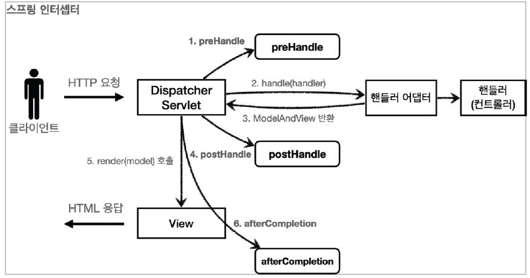
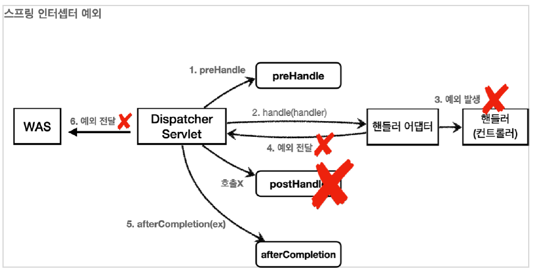

# 로그인 처리 - 필터, 인터셉터

로그인을 하지 않은 사용자에게는 상품 관리 버튼이 보이지 않아야 하는데 ULR을 직접 호출하면 상품 관리 화면에 들어갈 수 있어서 문제가 있다.

상품 관리 컨트롤러에서 로그인 여부를 체크하는 로직을 작성해도 되지만, 향후 로직이 변경되면 모든 로직을 다 수정해야 할 수 있다.

애플리케이션 여러 로직에서 공통으로 관심이 있는 것을 공통 관심사(cross-cutting concern)라고 한다.

공통 관심사는 스프링의 AOP로 해결할 수 있지만, 웹과 관련된 공통 관심사는 서블릿 필터 또는 스프링 인터셉터를 사용하는 것이 좋다.

웹과 관련된 공통 관심사를 처리할 때는 HTTP의 헤더나 URL의 정보들이 필요한데, 서블릿 필터나 스프링 인터셉터는 `HttpServletRequest`를 제공한다.

---

## 서블릿 필터

필터는 서블릿이 지원하는 수문장이다.

### 필터 흐름

```text

HTTP 요청 -> WAS -> 필터 -> 서블릿 -> 컨트롤러

```

필터를 적용하면 필터가 호출 된 다음 서블릿이 호출된다.

그래서 모든 고객의 요청 로그를 남기는 경우엔 필터를 사용하면 된다.

### 필터의 제한

```text

HTTP 요청 -> WAS -> 필터 -> 서블릿 -> 컨트롤러 //로그인 사용자

HTTP 요청 -> WAS -> 필터(적절하지 않는 요청이라 판단, 서블릿 호출X) //비 로그인 사용자

```

### 필터 체인

```text

HTTP 요청 -> WAS -> 필터1 -> 필터2 -> 필터3 -> 서블릿 -> 컨트롤러

```

### 필터 인터페이스

```java
public interface Filter {
    public default void init(FilterConfig filterConfig) throws ServletException {
    }

    public void doFilter(ServletRequest request, ServletResponse response,
                         FilterChain chain) throws IOException, ServletException;

    public default void destroy() {
    }
}
```

필터 인터페이스를 구현하고 등록하면 서블릿 컨테이너가 필터를 싱글톤 객체로 생성하고 관리한다.

+ init(): 필터 초기화, 서블릿 컨테이너가 생성될 때 호출
+ doFilter(): 고객의 요청이 올 때마다 해당 메서드 호출, 필터의 로직 구현 부분
+ destroy(): 필터 종료 메서드, 서블릿 컨테이너가 종료될 때 호출

---

## 서블릿 필터 - 요청 로그

```java

@Slf4j
public class LogFilter implements Filter {
    @Override
    public void init(FilterConfig filterConfig) throws ServletException {
        log.info("log filter init");
    }

    @Override
    public void doFilter(ServletRequest request, ServletResponse response, FilterChain chain) throws IOException, ServletException {
        log.info("log filter doFilter");
        HttpServletRequest httpRequest = (HttpServletRequest) request;
        String requestURI = httpRequest.getRequestURI();

        String uuid = UUID.randomUUID().toString();
        try {
            log.info("REQUEST [{}[{}]", uuid, requestURI);
            chain.doFilter(request, response);
        } catch (Exception e) {
            throw e;
        } finally {
            log.info("RESPONSE [{}][{}]", uuid, requestURI);
        }
    }

    @Override
    public void destroy() {
        log.info("log filter destroy");
    }
}
```

필터를 사용하려면 Filter 인터페이스를 구현해야 한다.

+ `doFilter()`
    + HTTP 요청이 오면 doFilter가 호출된다.
    + HTTP를 사용하면 `HttpServletRequest` 로 다운 캐스팅하여 사용한다.

+ `chain.doFilter(request,response)`
    + 다음 필터가 있으면 다음 필터를 호출하고, 없으면 서블릿을 호출한다.
        + 호출하지 않으면 다음단계로 진행되지 않는다.

```java

@Configuration
public class WebConfig {

    @Bean
    public FilterRegistrationBean logFilter() {
        FilterRegistrationBean<Filter> filterRegistrationBean = new FilterRegistrationBean<>();
        filterRegistrationBean.setFilter(new LogFilter());
        filterRegistrationBean.setOrder(1);
        filterRegistrationBean.addUrlPatterns("/*");

        return filterRegistrationBean;
    }
}
```

필터를 등록할 때는 `FilterRegistrationBean`을 사용하여 등록한다.

`setFilter`: 등록할 필터 지정

`setOrder(1)`: 필터의 순서를 지정. 낮을 수록 먼저 동작한다.

`addUrlPatterns`: 필터를 적용할 URL 패턴 지정

---

## 서블릿 필터 - 인증 체크

로그인이 되지 않은 사용자는 상품 관리 뿐만 아니라 미래에 개발될 페이지에도 접근하지 못하도록 한다.

---

```java

@Slf4j
public class LoginCheckFilter implements Filter {

    private static final String[] whiteList = {"/", "/members/add", "/login", "/logout", "/css/*"};

    @Override
    public void doFilter(ServletRequest request, ServletResponse response, FilterChain chain) throws IOException, ServletException {

        HttpServletRequest httpRequest = (HttpServletRequest) request;
        String requestURI = httpRequest.getRequestURI();

        HttpServletResponse httpResponse = (HttpServletResponse) response;

        try {
            log.info("인증 체크 필터 시작{}", requestURI);

            if (isLoginCheckPath(requestURI)) {
                log.info("인증 체크 로직 실행 {}", requestURI);
                HttpSession session = httpRequest.getSession(false);

                if (session == null || session.getAttribute(SessionConst.LOGIN_MEMBER) == null) {

                    log.info("미인증 사용자 요청 {}", requestURI);
                    //로그인으로 redirect

                    httpResponse.sendRedirect("/login?redirectURL=" + requestURI);
                    return;
                }
            }

            chain.doFilter(request, response);
        } catch (Exception e) {
            throw e;
        } finally {
            log.info("인증 체크 필터 종료 {}", requestURI);
        }
    }


    /**
     * 화이트 리스트의 경우 인증 체크 X
     */
    private boolean isLoginCheckPath(String requestURI) {
        return !PatternMatchUtils.simpleMatch(whiteList, requestURI);
    }
}

```

`private static final String[] whiteList = {"/", "/members/add", "/login", "/logout", "/css/*"};`

인증이 필요없는 경로 설정

`Filter` 인터페이스의 `init()`과 `destroy()`는 default 키워드가 붙어서 필수로 구현하지 않아도 된다.

`httpResponse.sendRedirect("/login?redirectURL=" + requestURI);`

미인증 사용자는 로그인 화면으로 리다이렉트 하는데 requestURI를 쿼리 파라미터로 함께 전달하면 로그인 직전에 요청했던 경로로 리다이렉트 할 수 있다.

```java
    @Bean
public FilterRegistrationBean loginCheckFilter(){
        FilterRegistrationBean<Filter> filterRegistrationBean=new FilterRegistrationBean<>();
        filterRegistrationBean.setFilter(new LoginCheckFilter());
        filterRegistrationBean.setOrder(2);
        filterRegistrationBean.addUrlPatterns("/*");

        return filterRegistrationBean;
        }
```

`WebConfig`에 빈 추가

```java
    @PostMapping("/login")
public String loginV4(@Validated @ModelAttribute LoginForm form,BindingResult bindingResult,
@RequestParam(defaultValue = "/") String redirectURL,
        HttpServletRequest request){

        if(bindingResult.hasErrors()){
        return"/login/loginForm";
        }

        Member loginMember=loginService.login(form.getLoginId(),form.getPassword());


        if(loginMember==null){
        bindingResult.reject("loginFail","아이디 또는 비밀번호가 맞지 않습니다.");
        return"login/loginForm";
        }

        //로그인 성공 처리
        //세션이 있으면 세션 반환, 없으면 신규 세션 생성
        HttpSession session=request.getSession();
        //세션에 로그인 회원 정보 보관
        session.setAttribute(SessionConst.LOGIN_MEMBER,loginMember);

        return"redirect:"+redirectURL;
        }
```

`@RequestParam` 애노테이션을 이용해 요청했던 경로를 알아내고 로그인에 성공하면 `return "redirect:" + redirectURL;`으로 redirect한다.

---

## 스프링 인터셉터

스프링 인터셉터도 서블릿 필터와 같이 웹과 관련된 공통 관심 사항을 효과적으로 해결할 수 있다.

---

**스프링 인터셉터 흐름**

```text

HTTP 요청 -> WAS -> 필터 -> 서블릿 -> 스프링 인터셉터 -> 컨트롤러

```

+ 스프링 인터셉터는 디스패처 서블릿과 컨트롤러 사이에서 컨트롤러 호출 직전에 호출 된다.
+ 스프링 MVC가 제공하는 기능이기 때문에 디스패처 서블릿 이후에 등장하게 된다.
+ 서블릿 필터처럼 URL 패턴을 적용할 수 있는데 매우 정밀하게 설정이 가능하다.

**스프링 인터셉터 제한**

```text

HTTP 요청 -> WAS -> 필터 -> 서블릿 -> 스프링 인터셉터 -> 컨트롤러

HTTP 요청 -> WAS -> 필터 -> 서블릿 -> 스프링 인터셉터 

```

**스프링 인터셉터 체인**

`HTTP 요청 -> WAS -> 필터 -> 서블릿 -> 인터셉터1 -> 인터셉터2 -> 컨트롤러`

### 스프링 인터셉터 인터페이스

```java
public interface HandlerInterceptor {
    default boolean preHandle(HttpServletRequest request, HttpServletResponse
            response,
                              Object handler) throws Exception {
    }

    default void postHandle(HttpServletRequest request, HttpServletResponse
            response,
                            Object handler, @Nullable ModelAndView modelAndView)
            throws Exception {
    }

    default void afterCompletion(HttpServletRequest request, HttpServletResponse
            response,
                                 Object handler, @Nullable Exception ex) throws
            Exception {
    }
}
```

서블릿 필터의 경우엔 `doFilter()`하나만 제공하지만 인터셉터는 `preHandle`, `postHandle`, `afterHandle`처럼 잘 세분화 되어있다.

인터셉터는 어떤 컨트롤러(`handler`)가 호출되는지 호출 정보도 받을 수 있고, 어떤 `ModelAndView`가 반환되는지 응답 정보도 받을 수 있다.




**정상 흐름**

+ `preHandle`: 컨트롤러 호출 전에 호출된다.
  + `preHandle`의 응답 값이 `ture`면 다음으로 진행하고 `false`이면 진행하지 않는다.
  + `flase`이면 나머지 인터셉터는 물론이고, 핸들러 어댑터도 호출되지 않는다.
+ `postHandle`: 컨트롤러 호출 후에 호출된다.
+ `afterCompletion`: 뷰가 렌더링 된 이후에 호출된다.



**예외 발생**

+ `preHandel`: 컨트롤러 호출 전에 호출
+ `postHandle`: 컨트롤러에서 예외가 발생하면 `postHandle`은 호출되지 않는다.
+ `afterCompletion`: 항상 호출된다. 예외를 파라미터로 받아서 로그를 출력할 수도 있다.

---

## 스프링 인터셉터 - 요청 로그

---

```java
@Slf4j
public class LogInterceptor implements HandlerInterceptor {

    public static final String LOG_ID = "logId";

    @Override
    public boolean preHandle(HttpServletRequest request, HttpServletResponse response, Object handler) throws Exception {

        String requestURI = request.getRequestURI();
        String uuid = UUID.randomUUID().toString();

        request.setAttribute(LOG_ID, uuid);

        //@RequestMapping: HandlerMethod
        //정적 리소스: ResourceHttpRequestHandler

        if (handler instanceof HandlerMethod) {
            HandlerMethod hm = (HandlerMethod) handler;// 호출할 컨트롤러 메서드의 모든 정보가 포함되어 있음
        }

        log.info("REQUEST [{}][{}][{}]", uuid, requestURI, handler);
        return true;
    }

    @Override
    public void postHandle(HttpServletRequest request, HttpServletResponse response, Object handler, ModelAndView modelAndView) throws Exception {
        log.info("postHandle [{}]", modelAndView);
    }

    @Override
    public void afterCompletion(HttpServletRequest request, HttpServletResponse response, Object handler, Exception ex) throws Exception {
        String requestURI = request.getRequestURI();

        String uuid = (String) request.getAttribute(LOG_ID);

        log.info("RESPONSE [{}][{}][{}]", uuid, requestURI, handler);

        if (ex != null) {
            log.error("AfterCompletion error!!", ex);
        }
    }
}
```

**HandlerMethod**

스프링은 일반적으로 `@Controller`, `@RequestMapping` 을 활용한 핸들러 매핑을 사용한다. 이 경우 핸들러 정보로 `HandlerMethod`가 넘어온다.

**ResourceHttpRequestHandler**

`/resources/static`같은 정적 리소스가 호출 되는 경우 `ResourceHttpRequestHandler`가 핸들러 정보로 넘어온다.

```java

@Configuration
public class WebConfig implements WebMvcConfigurer {

  @Override
  public void addInterceptors(InterceptorRegistry registry) {
    registry.addInterceptor(new LogInterceptor())
            .order(1)
            .addPathPatterns("/**")
            .excludePathPatterns("/css/**", "/*.ico", "/error");
  }
}
```

스프링의 URL 경로는 매우 세밀하게 설정할 수 있다. 

**PathPattern 공식 문서**

```text
? 한 문자 일치
* 경로(/) 안에서 0개 이상의 문자 일치
** 경로 끝까지 0개 이상의 경로(/) 일치
{spring} 경로(/)와 일치하고 spring이라는 변수로 캡처
{spring:[a-z]+} matches the regexp [a-z]+ as a path variable named "spring"
{spring:[a-z]+} regexp [a-z]+ 와 일치하고, "spring" 경로 변수로 캡처
{*spring} 경로가 끝날 때 까지 0개 이상의 경로(/)와 일치하고 spring이라는 변수로 캡처


/pages/t?st.html — matches /pages/test.html, /pages/tXst.html but not /pages/
toast.html
/resources/*.png — matches all .png files in the resources directory
/resources/** — matches all files underneath the /resources/ path, including /
resources/image.png and /resources/css/spring.css
/resources/{*path} — matches all files underneath the /resources/ path and
captures their relative path in a variable named "path"; /resources/image.png
will match with "path" → "/image.png", and /resources/css/spring.css will match
with "path" → "/css/spring.css"
/resources/{filename:\\w+}.dat will match /resources/spring.dat and assign the
value "spring" to the filename variable
```

---

## 스프링 인터셉터 - 인증 체크

---

```java
@Slf4j
public class LoginCheckInterceptor implements HandlerInterceptor {
    @Override
    public boolean preHandle(HttpServletRequest request, HttpServletResponse response, Object handler) throws Exception {

        String requestURI = request.getRequestURI();

        log.info("인증 체크 인터셉터 실행 {}",requestURI);

        HttpSession session = request.getSession();

        if(session==null || session.getAttribute(SessionConst.LOGIN_MEMBER)== null){
            log.info("미인증 사용자 요청");

            response.sendRedirect("/login?redirectURL=" + requestURI);
            return false;
        }

        return true;
    }
}
```

```java
registry.addInterceptor(new LoginCheckInterceptor())
                .order(2)
                .addPathPatterns("/**")
                .excludePathPatterns("/","/members/add","/login",
                        "/logout","/css/**","/*.ico","/error");

```

---

## ArgumentResolver 활용

---

```java
    @GetMapping("/")
    public String homeLoginV3ArgumentResolver(@Login Member loginMember, Model model){

        if(loginMember == null){
            return "home";
        }

        model.addAttribute("member",loginMember);
        return "loginHome";
    }
```


```java
@Target(ElementType.PARAMETER)
@Retention(RetentionPolicy.RUNTIME)
public @interface Login {
}
```

```java
@Slf4j
public class LoginMemberArgumentResolver implements HandlerMethodArgumentResolver {
    @Override
    public boolean supportsParameter(MethodParameter parameter) {
        log.info("supportsParameter 실행");

        boolean hasLoginAnnotation = parameter.hasParameterAnnotation(Login.class);
        boolean hasMemberType = Member.class.isAssignableFrom(parameter.getParameterType());

        return hasLoginAnnotation && hasMemberType;


    }

    @Override
    public Object resolveArgument(MethodParameter parameter, ModelAndViewContainer mavContainer, NativeWebRequest webRequest, WebDataBinderFactory binderFactory) throws Exception {

        log.info("resolveArgument 실행");

        HttpServletRequest request = (HttpServletRequest) webRequest.getNativeRequest();
        HttpSession session = request.getSession(false);
        if(session == null){
            return null;
        }

        return session.getAttribute(SessionConst.LOGIN_MEMBER);

    }
}
```

`supportsParameter()`: `@Login` 애노테이션이 있고 `Member`타입이면 `ArgumentResolver`가 사용된다.

```java
@Configuration
public class WebConfig implements WebMvcConfigurer {
  @Override
  public void addArgumentResolvers(List<HandlerMethodArgumentResolver> resolvers) {
    resolvers.add(new LoginMemberArgumentResolver());
  }
}
```

WebConfig에 `addArgumentResolvers`를 override하여 등록한다.


`ArgumentResolver`를 활용하면 공통 작업이 필요할 때 컨트롤러를 더욱 편리하게 사용할 수 있다.

