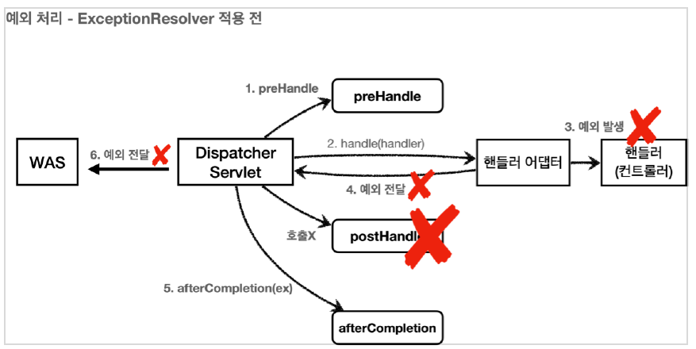
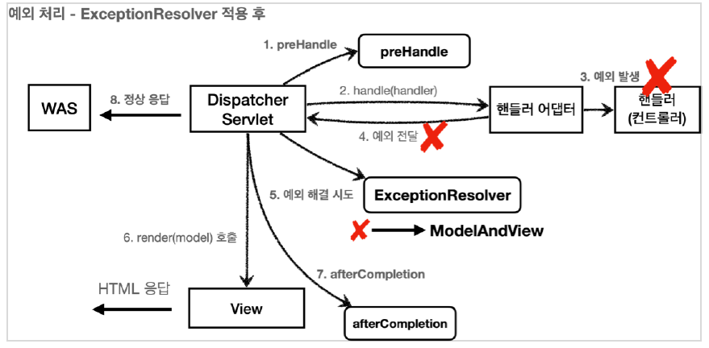

# API 예외 처리

API 오류의 경우 각 오류 상황에 맞는 오류 응답 스펙을 정하고, JSON으로 데이터를 내려주어야 한다.

---

```java
@Component
public class WebServerCustomizer implements WebServerFactoryCustomizer<ConfigurableWebServerFactory> {
    @Override
    public void customize(ConfigurableWebServerFactory factory) {

        ErrorPage errorPage404 = new ErrorPage(HttpStatus.NOT_FOUND, "/error-page/404");
        ErrorPage errorPage500 = new ErrorPage(HttpStatus.INTERNAL_SERVER_ERROR, "/error-page/500");

        ErrorPage errorPageEx = new ErrorPage(RuntimeException.class, "/error-page/500");

        factory.addErrorPages(errorPage404,errorPage500,errorPageEx);
    }
}
```

서블릿 예외처리때 사용하던 `WebServerCustomizer`의 `@Component`주석을 푼다.

이제 WAS에 예외가 전달되거나 `response.sendError()`가 호출되면 등록한 예외 페이지가 호출된다.


```java
@Slf4j
@RestController
public class ApiExceptionController {

    @GetMapping("/api/members/{id}")
    public MemberDto getMember(@PathVariable("id") String id){
        if(id.equals("ex")){
            throw new RuntimeException("잘못된 사용자");
        }

        return new MemberDto(id,"hello" + id);
    }


    @Data
    @AllArgsConstructor
    static class MemberDto{
        private String memberId;
        private String name;
    }
}
```

포스트맨으로 해당 경로에 `ex`로 요청하면 HTML 페이지가 반환된다. 

오류페이지도 JSON으로 반환되도록 해야한다.

ErrorPageController에 다음을 추가한다.

```java
    @RequestMapping(value = "/error-page/500",produces = MediaType.APPLICATION_JSON_VALUE)
    public ResponseEntity<Map<String,Object>> errorPage500Api(HttpServletRequest request, HttpServletResponse response){
        log.info("API errorPage 500");

        Map<String, Object> result = new HashMap<>();

        Exception ex = (Exception) request.getAttribute(ERROR_EXCEPTION);
        result.put("status",request.getAttribute(ERROR_STATUS_CODE));
        result.put("message",ex.getMessage());

        Integer statusCode = (Integer) request.getAttribute(RequestDispatcher.ERROR_STATUS_CODE);

        return new ResponseEntity<>(result, HttpStatus.valueOf(statusCode));
    }
```

`produces = MediaType.APPLICATION_JSON_VALUE`는 클라이언트의 `Accept`가 `application/json`인 경우에 호출 된다는 뜻이다.

다시 postman으로 ex를 요청하면 결과는 다음과 같다.

```text
{
    "message": "잘못된 사용자",
    "status": 500
}
```

이제 Accept 헤더의 값에 따라 HTML, JSON 방식으로 오류를 응답할 수 있다.

---

## API 예외 처리 - 스프링 부트 기본 오류 처리

API 예외 처리도 스프링 부트가 제공하는 기본 오류 방식을 사용할 수 있다.

---

스프링 부트가 제공하는 `BasicErrorController`를 보면 다음 두 메서드에 `@RequestMapping`되어있다.


```java
    @RequestMapping(produces = MediaType.TEXT_HTML_VALUE)
	public ModelAndView errorHtml(HttpServletRequest request, HttpServletResponse response) {
		HttpStatus status = getStatus(request);
		Map<String, Object> model = Collections
				.unmodifiableMap(getErrorAttributes(request, getErrorAttributeOptions(request, MediaType.TEXT_HTML)));
		response.setStatus(status.value());
		ModelAndView modelAndView = resolveErrorView(request, response, status, model);
		return (modelAndView != null) ? modelAndView : new ModelAndView("error", model);
	}

	@RequestMapping
	public ResponseEntity<Map<String, Object>> error(HttpServletRequest request) {
		HttpStatus status = getStatus(request);
		if (status == HttpStatus.NO_CONTENT) {
			return new ResponseEntity<>(status);
		}
		Map<String, Object> body = getErrorAttributes(request, getErrorAttributeOptions(request, MediaType.ALL));
		return new ResponseEntity<>(body, status);
	}
```


`produces = MediaType.TEXT_HTML_VALUE`는 Accept 헤더의 값이 `text/html`인 경우 호출된다.

그외의 경우에는 error 메서드가 호출되어 `ResponseEntity`로 HTTP body에 JSON 데이터를 반환한다.


### Html 페이지 Vs API 오류

`BasicErrorController`를 확장하면 JSON 메시지도 변경할 수 있다. 그런데 `@ExceptionHandler`가 제공하는 기능을 사용하는 것이 더 나은 방법이기 때문에 참고로만 알아두자.

`BasicErrorController`는 HTML 페이지를 제공하는 경우에 매우 편리하다. 즉 HTML 화면을 처리할 때 사용하고, API는 `@ExceptionHandler`를 사용하자.

---

## API 예외 처리 - HandlerExceptionResolver

예외가 발생해서 서블릿을 넘어 WAS까지 전달되면 HTTP 상태코드는 500으로 처리된다.

발생하는 예외에 따라서 다른 상태코드로 처리하고 싶고, 오류메시지 형식등을 API마다 다르게 처리하고 싶을때 사용한다.

---

### 상태코드 변환

`IllegalArgumentException`을 처리하지 못해서 컨트롤러 밖으로 넘어가는 일이 발생하면 HTTP 상태코드를 400으로 처리하게 해보자.


```java
@Slf4j
@RestController
public class ApiExceptionController {

    @GetMapping("/api/members/{id}")
    public MemberDto getMember(@PathVariable("id") String id){
        if(id.equals("ex")){
            throw new RuntimeException("잘못된 사용자");
        }

        if(id.equals("bad")){
            throw new IllegalArgumentException("잘못된 입력 값");
        }

        return new MemberDto(id,"hello" + id);
    }


    @Data
    @AllArgsConstructor
    static class MemberDto{
        private String memberId;
        private String name;
    }
}
```


```text
{
    "timestamp": "2022-03-17T06:42:43.991+00:00",
    "status": 500,
    "error": "Internal Server Error",
    "exception": "java.lang.IllegalArgumentException",
    "path": "/api/members/bad"
}
```

실행결과는 상태 코드가 500으로 나온다. WAS는 Exception이 터졌기 때문에 500으로 처리한다.

### HandlerExceptionResolver

스프링 MVC는 컨트롤러 밖으로 예외가 던져진 경우 예외를 해결하고, 동작을 새로 정의할 수 있는 방법을 제공한다.







`ExceptionResolver`로 예외를 해결해도 `postHandle()`은 호출되지 앟는다.

```java
@Slf4j
public class MyHandlerExceptionResolver implements HandlerExceptionResolver {
    @Override
    public ModelAndView resolveException(HttpServletRequest request, HttpServletResponse response, Object handler, Exception ex) {
        try {
            if (ex instanceof IllegalArgumentException) {
                log.info("IllegalArgumentException resolver to 400");
                response.sendError(HttpServletResponse.SC_BAD_REQUEST, ex.getMessage());
                return new ModelAndView();
            }
        } catch (IOException e) {
            log.error("resolver ex",e);
        }

        return null;
    }
}
```


`ExceptionResolver`가 ModelAndView를 반환하는 이유는 `Exception`을 정상 흐름 처럼 변경하기 위해서이다.

위에선 `IllegalArgumentException`이 발생하면 `response.sendError()`를 호출해서 HTTP 상태 코드를 400으로 저장하고, 빈 `ModelAndView`를 반환한다.

`ModelAndView`가 비어있으면 뷰를 렌더링하지 않고 정상 흐름으로 서블릿이 리턴된다.

비어있지 않으면 `Veiw`, `Model`등의 정보를 지정해서 반환하면 뷰를 렌더링 한다.

`null`을 반환하면 다음 `ExceptionResolver`를 찾아서 실행한다. 만약 처리할 수 있는 `ExceptionResolver`가 없으면 기존에 발생한 예외를 서블릿 밖으러 던진다.


```text
{
    "timestamp": "2022-03-17T06:55:28.696+00:00",
    "status": 400,
    "error": "Bad Request",
    "exception": "java.lang.IllegalArgumentException",
    "path": "/api/members/bad"
}
```

### ExceptionResolver 활용

+ 예외 상태 코드 변환
  + 예외를 `response.sendError(xxx)` 호출로 변경해서 서블릿에서 상태 코드에 따른 오류를 처리하도록 위임
  + 이후 WAS는 서블릿 오류 페이지를 찾아서 내부 호출
+ 뷰 템플릿 처리
  + `ModelAndView`에 값을 채워서 내부 호출
+ API 응답 처리
  + `response.getWriter().println("hello")`처럼 HTTP 응답 바디에 직접 데이터를 넣어주는 것도 가능하다. JSON으로 응답하면 API 응답 처리를 할 수 있다.


ExceptionResolver 등록

```java
@Configuration
public class WebConfig implements WebMvcConfigurer {

    @Override
    public void addInterceptors(InterceptorRegistry registry) {
        registry.addInterceptor(new LogInterceptor())
                .order(1)
                .addPathPatterns("/**")
                .excludePathPatterns("/css/**", "*.ico", "/error", "/error-page/**");
    }

    @Override
    public void extendHandlerExceptionResolvers(List<HandlerExceptionResolver> resolvers) {
        resolvers.add(new MyHandlerExceptionResolver());
    }
}
```

---

## API 예외 처리 - HandlerExceptionResolver 활용

### 예외를 여기서 마무리하기

예외가 발생하면 WAS까지 예외가 던져지고, 다시 /error를 호출하는 과정이 너무 복잡하다.

`ExceptionResolver`를 활용하면 예외가 발생했을 때 이런 복잡한 과정 없이 문제를 깔끔하게 해결할 수 있다.

---

```java
public class UserException extends RuntimeException{
    public UserException() {
        super();
    }

    public UserException(String message) {
        super(message);
    }

    public UserException(String message, Throwable cause) {
        super(message, cause);
    }

    public UserException(Throwable cause) {
        super(cause);
    }

    protected UserException(String message, Throwable cause, boolean enableSuppression, boolean writableStackTrace) {
        super(message, cause, enableSuppression, writableStackTrace);
    }
}
```

```java
@Slf4j
@RestController
public class ApiExceptionController {

    @GetMapping("/api/members/{id}")
    public MemberDto getMember(@PathVariable("id") String id){
        if(id.equals("ex")){
            throw new RuntimeException("잘못된 사용자");
        }

        if(id.equals("bad")){
            throw new IllegalArgumentException("잘못된 입력 값");
        }

        if(id.equals("user-ex")){
            throw new UserException("사용자 오류");
        }
        return new MemberDto(id,"hello" + id);
    }


    @Data
    @AllArgsConstructor
    static class MemberDto{
        private String memberId;
        private String name;
    }
}
```

```java
@Slf4j
public class UserHandlerExceptionResolver implements HandlerExceptionResolver {

    private final ObjectMapper objectMapper = new ObjectMapper();

    @Override
    public ModelAndView resolveException(HttpServletRequest request, HttpServletResponse response, Object handler, Exception ex) {

        try {
            if(ex instanceof UserException){
                log.info("UserException resolver to 400");
                String acceptHeader = request.getHeader("accept");
                response.setStatus(HttpServletResponse.SC_BAD_REQUEST);

                if("application/json".equals(acceptHeader)){
                    Map<String,Object> errorResult = new HashMap<>();
                    errorResult.put("ex",ex.getClass());
                    errorResult.put("message",ex.getMessage());

                    String result = objectMapper.writeValueAsString(errorResult);

                    response.setContentType("application/json");
                    response.setCharacterEncoding("utf-8");
                    response.getWriter().write(result);

                    return new ModelAndView();

                } else{
                    return new ModelAndView("error/500");
                }
            }
        } catch (IOException e) {
            log.error("resolver ex", e);
        }

        return null;
    }
}
```

```java
    @Override
    public void extendHandlerExceptionResolvers(List<HandlerExceptionResolver> resolvers) {
        resolvers.add(new MyHandlerExceptionResolver());
        resolvers.add(new UserHandlerExceptionResolver());
        }
```

`ExceptionResolver`를 사용하면 컨트롤러에서 예외가 발생해도 `ExceptionResolver`에서 예외를 처리해버린다.

따라서 서블릿 컨테이너까지 예외가 전달되지 않고 스프링 MVC에서 예외 처리는 끝이 난다.

---

## 스프링이 제공하는 ExceptionResolver1

스프링 부트가 기본으로 제공하는 `ExceptionResolver`는 다음과 같다.

1. `ExceptionHandlerExceptionResolver`
2. `ResponseStatusExceptionResolver`
3. `DefaultHandlerExceptionResolver`

### ExceptionHandlerExceptionResolver

`@ExceptionHandler`를 처리한다. API 예외 처리는 대부분 이 기능으로 해결한다.

### ResponseStatusExceptionResolver

HTTP 상태 코드를 지정해준다.

`@ResponseStatus(value = HttpStatus.NOT_FOUND`

### DefaultHandlerExceptionResolver

스프링 내부 기본 예외를 처리한다.

---


## ResponseStatusExceptionResolver

다음 두 가지 경우를 처리한다.

+ `@ResponseStatus`가 달려있는 예외
+ `ResponseStatusException`예외


```java
@ResponseStatus(code = HttpStatus.BAD_REQUEST, reason = "잘못된 요청 오류")
public class BadRequestException extends RuntimeException{

}
```

```java
    @GetMapping("/api/response-status-ex1")
    public String responseStatusEx1(){
        throw new BadRequestException();
    }
```

결과
```text
{
    "timestamp": "2022-03-17T12:16:57.969+00:00",
    "status": 400,
    "error": "Bad Request",
    "exception": "hello.exception.exception.BadRequestException",
    "message": "잘못된 요청 오류",
    "path": "/api/response-status-ex1"
}
```

500 오류가 아닌 400 오류로 반환된다.

`reason`을 `MessageSource`에서 찾는 기능도 제공한다.

messages.properties

`error.bad=잘못된 요청 오류입니다. 메시지 사용`

```java
@ResponseStatus(code = HttpStatus.BAD_REQUEST, reason = "error.bad")
public class BadRequestException extends RuntimeException{
}
```

```text
{
    "timestamp": "2022-03-17T12:28:02.995+00:00",
    "status": 400,
    "error": "Bad Request",
    "exception": "hello.exception.exception.BadRequestException",
    "message": "잘못된 요청 오류입니다. 메시지 사용",
    "path": "/api/response-status-ex1"
}
```

### ResponseStatusException

`@ResponseStatus`는 개발자가 직접 변경할 수 없는 예외에는 적용할 수 없다. (애노테이션을 직접 넣어야 하는데, 내가 코드를 수정할 수 없는 라이브러리의 예외 코드 같은 곳)

이때는 `ResponseStatusException`예외를 사용하면 된다.


```java
   @GetMapping("/api/response-status-ex2")
    public String responseStatusEx2(){
        throw new ResponseStatusException(HttpStatus.NOT_FOUND,"error.bad",new IllegalArgumentException());
    }
```

```text
{
    "timestamp": "2022-03-17T12:31:33.640+00:00",
    "status": 404,
    "error": "Not Found",
    "exception": "org.springframework.web.server.ResponseStatusException",
    "message": "잘못된 요청 오류입니다. 메시지 사용",
    "path": "/api/response-status-ex2"
}
```

---

## 스프링이 제공하는 ExceptionResolver2

`DefaultHandlerExceptionResolver`는 스프링 내부에서 발생하는 스프링 예외를 해결한다.

대표적으로 파라미터 바인딩 시점에 타입이 맞지 않으면 `TypeMismatchException`이 발생하는데, 그냥 두면 서블릿 컨테이너까지 올라가고 결과적으로 500 오류가 발생한다.


```java
    @GetMapping("/api/default-handler-ex")
    public String defaultException(@RequestParam Integer data){
        return "ok";
    }
```


`http://localhost:8080/api/default-handler-ex?data=qqq`

```text
{
    "timestamp": "2022-03-17T12:36:43.599+00:00",
    "status": 400,
    "error": "Bad Request",
    "exception": "org.springframework.web.method.annotation.MethodArgumentTypeMismatchException",
    "message": "Failed to convert value of type 'java.lang.String' to required type 'java.lang.Integer'; nested exception is java.lang.NumberFormatException: For input string: \"qqq\"",
    "path": "/api/default-handler-ex"
}
```

결과를 보면 status가 400이다. 그 이유는 `DefaultHandlerExceptionResolver`에서 `response.sendError()`를 사용해서 400을 호출하기 때문이다.

`HandlerExceptionResolver`를 직접 사용하는건 복잡하다. API 오류의 경우 `response`에 직접 데이터를 넣어야 하고 `ModelAndView`를 반환 하는것도 API에는 잘 맞지 않는다.

스프링은 이 문제들을 해결하기 위해 `@ExceptionHandler`라는 기능을 제공한다.

---

## @ExceptionHandler

### HTML 화면 오류 Vs API 오류

웹 브라우저에 HTML 화면을 제공할 때는 `BasicErrorController`를 사용하는게 편하다.

API는 각 시스템 마다 응답의 모양도 다르고, 스펙도 모두 다르다. 예외에 따라서 각각 다른 데이터를 출력해야 한다.

결국 `BasicErrorController`나 `HandlerExceptionResolver`는 API 예외를 다루기에 적합하지 않다.

---

스프링은 API 예외 처리 문제를 해결하기 위해 `@ExceptionHandler`라는 애노테이션을 사용하는 매우 편리한 예외 처리 기능을 제공한다.

이것이 `ExceptionHandlerExceptionResolver`이다.

```java
@Data
@AllArgsConstructor
public class ErrorResult {

    private String code;
    private String message;
}
```

예외 발생 시 API 응답으로 사용할 객체

```java
@Slf4j
@RestController
public class ApiExceptionV2Controller {

    @ResponseStatus(HttpStatus.BAD_REQUEST)
    @ExceptionHandler(IllegalArgumentException.class)
    public ErrorResult illegalExHandler(IllegalArgumentException e){
        log.error("[exceptionHandler] ex",e);
        return new ErrorResult("BAD",e.getMessage());
    }

    @ExceptionHandler
    public ResponseEntity<ErrorResult> userExHandler(UserException e){
        log.error("[exceptionHandler] ex",e);
        ErrorResult errorResult = new ErrorResult("USER-EX", e.getMessage());
        return new ResponseEntity(errorResult,HttpStatus.BAD_REQUEST);
    }

    @ResponseStatus(HttpStatus.INTERNAL_SERVER_ERROR)
    @ExceptionHandler
    public ErrorResult exHandler(Exception e){
        log.error("[exceptionHandler] ex",e);
        return new ErrorResult("EX","내부 오류");
    }

    @GetMapping("/api2/members/{id}")
    public MemberDto getMember(@PathVariable("id") String id){
        if(id.equals("ex")){
            throw new RuntimeException("잘못된 사용자");
        }

        if(id.equals("bad")){
            throw new IllegalArgumentException("잘못된 입력 값");
        }

        if(id.equals("user-ex")){
            throw new UserException("사용자 오류");
        }
        return new MemberDto(id,"hello" + id);
    }

    @Data
    @AllArgsConstructor
    static class MemberDto{
        private String memberId;
        private String name;
    }
}
```

`@ExceptionHandler`는 해당 컨트롤러에서 예외가 발생했을 때 처리할 수 있는 애노테이션이다.

```java
    @ResponseStatus(HttpStatus.BAD_REQUEST)
    @ExceptionHandler(IllegalArgumentException.class)
    public ErrorResult illegalExHandler(IllegalArgumentException e){
        log.error("[exceptionHandler] ex",e);
        return new ErrorResult("BAD",e.getMessage());
    }
```

`IllegalArgumentException`예외가 발생했을때나 `IllegalArgumentException`의 자식 클래스의 예외가 발생했을 때 처리할 수 있다.

`@ExceptionHandler`의 파라미터로 list를 넣으면 리스트 안의 다양한 예외를 한번에 처리할 수도 있다.

`@ExceptionHandler({AException.class,BException.class})`

### 예외 생략

```java
@ExceptionHandler
public ResponseEntity<ErrorResult> userExHandle(UserException e) {}
```
애노테이션의 파라미터를 생략하면 메서드 파라미터의 예외가 지정된다.


```java
    @ResponseStatus(HttpStatus.BAD_REQUEST)
    @ExceptionHandler(IllegalArgumentException.class)
    public ErrorResult illegalExHandler(IllegalArgumentException e){
        log.error("[exceptionHandler] ex",e);
        return new ErrorResult("BAD",e.getMessage());
    }
```

+ 컨트롤러를 호출한 결과 `IllegalArgumentException` 예외가 컨트롤러 밖으로 던져진다.
+ 예외가 발생했으므로 `ExceptionResolver`가 작동한다.
+ 우선순위가 가장높은 `ExceptionHandlerExceptionResolver`가 실행된다.
+ `@ExceptionHandler`를 확인하고 처리할 수 있는지 확인한다.
+ `illegalExHandler`를 실행한다.

---

## @ControllerAdvice

`@ExceptionHandler`를 사용해서 예외를 깔끔하게 처리할 수 있게 되었지만, 하나의 컨트롤러 안에 정상코드와 예외처리 코드가 섞여있다.

`@ControllerAdvice`, `@RestControllerAdvice`를 사용하면 둘을 분리할 수 있다.

---

```java
@Slf4j
@RestControllerAdvice
public class ExControllerAdvice {

    @ResponseStatus(HttpStatus.BAD_REQUEST)
    @ExceptionHandler(IllegalArgumentException.class)
    public ErrorResult illegalExHandler(IllegalArgumentException e){
        log.error("[exceptionHandler] ex",e);
        return new ErrorResult("BAD",e.getMessage());
    }

    @ExceptionHandler
    public ResponseEntity<ErrorResult> userExHandler(UserException e){
        log.error("[exceptionHandler] ex",e);
        ErrorResult errorResult = new ErrorResult("USER-EX", e.getMessage());
        return new ResponseEntity(errorResult,HttpStatus.BAD_REQUEST);
    }

    @ResponseStatus(HttpStatus.INTERNAL_SERVER_ERROR)
    @ExceptionHandler
    public ErrorResult exHandler(Exception e){
        log.error("[exceptionHandler] ex",e);
        return new ErrorResult("EX","내부 오류");
    }
}
```

```java
@Slf4j
@RestController
public class ApiExceptionV2Controller {

    @GetMapping("/api2/members/{id}")
    public MemberDto getMember(@PathVariable("id") String id) {
        if (id.equals("ex")) {
            throw new RuntimeException("잘못된 사용자");
        }

        if (id.equals("bad")) {
            throw new IllegalArgumentException("잘못된 입력 값");
        }

        if (id.equals("user-ex")) {
            throw new UserException("사용자 오류");
        }
        return new MemberDto(id, "hello" + id);
    }

    @Data
    @AllArgsConstructor
    static class MemberDto {
        private String memberId;
        private String name;
    }
}
```

둘을 분리하여 사용할 수 있다.

